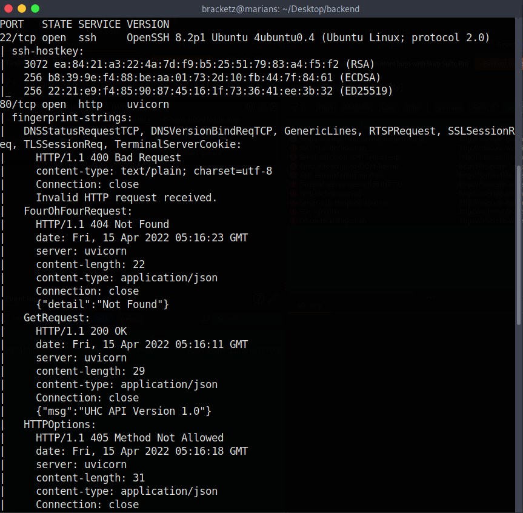

# Backend - HTB/UHC

Nmap scan to discover open ports and service versions.



Performing routes enumeration in web service.


API route:


Docs route:


Finding the signup method to register in the application, fuzz with post method.


In the body, we can send the parameters “email” and “password” to register a new user in the API.


To see the documentation we need to set the bearer token in the Authorization header.


Looking the API documentation in the browser.


Admin user 


Updating the root password using the GUID.


After change, we were able to get the administrator JWT token.


In the API there is a route that we can use to obtain machine files.


Listing environment variables from the server.


After many enumerations, we obtained the Python configuration file of the project, containing the JWT secret.

```python
"file": "/home/htb/uhc/app/core/config.py"
```


Crafting a new JWT using the secret token.


With the debug permission, now we can use the route “/api/v1/admin/exec” to execute commands remotely.


Reading the “auth.log” file inside UHC we can obtain the root password.


Catching the flag.


