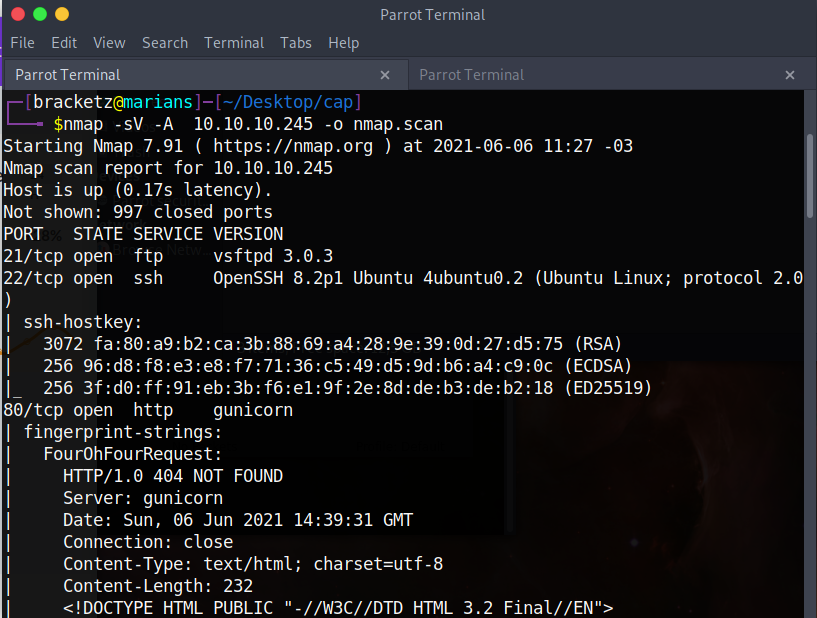

# Cap


### 06/06/2021

This machine is probably the most easiest on the HackTheBox platform.

First nmap scan to discover open ports and service versions.



gobuster directories scan.


Interesting routes.


In the data has pcap files download.


Download 0 and 5 and analyze the pcap files.


In pcap 0 has :


```python
220 (vsFTPd 3.0.3)
USER nathan
331 Please specify the password.
PASS Buck3tH4TF0RM3!
230 Login successful.
SYST
```

The user flag are on FTP server.


SSH login


Finding files with capabilities and explore to get the root session:


[https://www.hackingarticles.in/linux-privilege-escalation-using-capabilities/](https://www.hackingarticles.in/linux-privilege-escalation-using-capabilities/)

```python
20.04.2 LTS (Focal Fossa)
/etc/cron.d:
27.0.0.1:33255         127.0.0.53:domain  
/var/lib/fwupd/pending.db
/var/lib/command-not-found/commands.db
/var/lib/PackageKit/transactions.db
/usr/lib/firmware/regulatory.db

/usr/bin/python3.8 = cap_setuid,cap_net_bind_service+eip
```