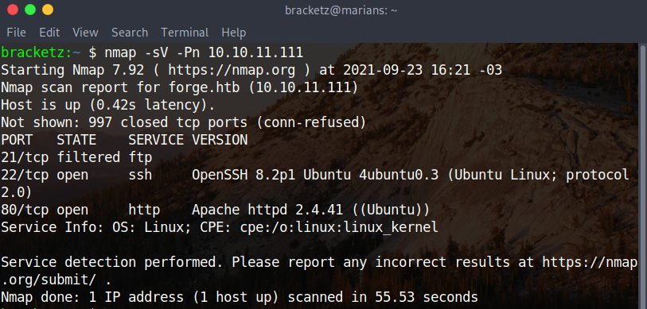

# Forge


### 09/23/2021

Nmap scan:



Vhost enumeration: Exists admin subdomain. 


Identifying version of python:


Trying SSRF against admin vhost: In the normal way the server reject the domain, but we can try a bypass.


Yeah just changing a character we can bypass subdomain return:


We are in the admin portal now:


Ftp credentials:


```python
user:heightofsecurity123!
```

Parameters to make the request in FTP:


Yeah the request work with U parameter: It's interesting work with machine, testing and try amazing things. 


Trying login in FTP via URL, it's simple just paste login and password more host like this:


With test return user flag from the system:


I craft one exploit to make the curl himself:


Listing snap files:


FUUUUUUUUUUUUUUUUUUUUUUUUUUUUCK 

WE CAN LISTEN THE ENTIRE PATH WITH /


Exploring the web server folder:


wsgi file configuration

```python
#!/usr/bin/env python3
import sys
import logging
import os

logging.basicConfig(stream=sys.stderr)
sys.path.insert(0, "/var/www/admin/")
venv = 'var/www/admin/admin/venv/bin/activate_this.py'

def execfile(filepath, globals=None, locals=None):
    if globals is None:
        globals = {}
    globals.update({
        "__file__": filepath,
        "__name__": "__main__",
    })
    with open(filepath, 'rb') as file:
        exec(compile(file.read(), filepath, 'exec'), globals, locals)

# execute the file
execfile(venv)

from admin import app as application
application.secret_key = os.urandom(16)
application.config['TRAP_HTTP_EXCEPTIONS'] = True
application.config['UPLOAD_FOLDER'] = '/var/www/forge/forge/uploads/'

import admin.routes
application.jinja_env.trim_blocks = True
application.jinja_env.lstrip_blocks = True
```

Password file:

```python
root:x:0:0:root:/root:/bin/bash
daemon:x:1:1:daemon:/usr/sbin:/usr/sbin/nologin
bin:x:2:2:bin:/bin:/usr/sbin/nologin
sys:x:3:3:sys:/dev:/usr/sbin/nologin
sync:x:4:65534:sync:/bin:/bin/sync
games:x:5:60:games:/usr/games:/usr/sbin/nologin
man:x:6:12:man:/var/cache/man:/usr/sbin/nologin
lp:x:7:7:lp:/var/spool/lpd:/usr/sbin/nologin
mail:x:8:8:mail:/var/mail:/usr/sbin/nologin
news:x:9:9:news:/var/spool/news:/usr/sbin/nologin
uucp:x:10:10:uucp:/var/spool/uucp:/usr/sbin/nologin
proxy:x:13:13:proxy:/bin:/usr/sbin/nologin
www-data:x:33:33:www-data:/var/www:/usr/sbin/nologin
backup:x:34:34:backup:/var/backups:/usr/sbin/nologin
list:x:38:38:Mailing List Manager:/var/list:/usr/sbin/nologin
irc:x:39:39:ircd:/var/run/ircd:/usr/sbin/nologin
gnats:x:41:41:Gnats Bug-Reporting System (admin):/var/lib/gnats:/usr/sbin/nologin
nobody:x:65534:65534:nobody:/nonexistent:/usr/sbin/nologin
systemd-network:x:100:102:systemd Network Management,,,:/run/systemd:/usr/sbin/nologin
systemd-resolve:x:101:103:systemd Resolver,,,:/run/systemd:/usr/sbin/nologin
systemd-timesync:x:102:104:systemd Time Synchronization,,,:/run/systemd:/usr/sbin/nologin
messagebus:x:103:106::/nonexistent:/usr/sbin/nologin
syslog:x:104:110::/home/syslog:/usr/sbin/nologin
_apt:x:105:65534::/nonexistent:/usr/sbin/nologin
tss:x:106:111:TPM software stack,,,:/var/lib/tpm:/bin/false
uuidd:x:107:112::/run/uuidd:/usr/sbin/nologin
tcpdump:x:108:113::/nonexistent:/usr/sbin/nologin
landscape:x:109:115::/var/lib/landscape:/usr/sbin/nologin
pollinate:x:110:1::/var/cache/pollinate:/bin/false
sshd:x:111:65534::/run/sshd:/usr/sbin/nologin
systemd-coredump:x:999:999:systemd Core Dumper:/:/usr/sbin/nologin
user:x:1000:1000:NoobHacker:/home/user:/bin/bash
lxd:x:998:100::/var/snap/lxd/common/lxd:/bin/false
usbmux:x:112:46:usbmux daemon,,,:/var/lib/usbmux:/usr/sbin/nologin
ftp:x:113:118:ftp daemon,,,:/srv/ftp:/usr/sbin/nologin
```

This is a amazing trick, basically we force to find .ssh guessing


Now it's get id_rsa and login into SSH session:

In a funny attemp i can login into the remote manage without password and read the file.


So i test each command when i reach the longList it returns a python code, probably the code of the application and it shows the secret password:


In other SSH session i test and secret password works:


It shows some information about status of the machnie, but it not much interesting to us:


I test a python boolean logic described in my archive and crash the program, again i can reach the command line:  Not work because the application don't has the eval function. 


```python
1  	#!/usr/bin/env python3
  2  	import socket
  3  	import random
  4  	import subprocess
  5  	import pdb
  6  	
  7  	port = random.randint(1025, 65535)
  8  	
  9  	try:
 10  	    sock = socket.socket(socket.AF_INET, socket.SOCK_STREAM)
 11  	    sock.setsockopt(socket.SOL_SOCKET, socket.SO_REUSEADDR, 1)
 12  	    sock.bind(('127.0.0.1', port))
 13  	    sock.listen(1)
 14  	    print(f'Listening on localhost:{port}')
 15  	    (clientsock, addr) = sock.accept()
 16  	    clientsock.send(b'Enter the secret passsword: ')
 17  	    if clientsock.recv(1024).strip().decode() != 'secretadminpassword':
 18  >>	        clientsock.send(b'Wrong password!\n')
 19  	    else:
 20  	        clientsock.send(b'Welcome admin!\n')
 21  	        while True:
 22  	            clientsock.send(b'\nWhat do you wanna do: \n')
 23  	            clientsock.send(b'[1] View processes\n')
 24  	            clientsock.send(b'[2] View free memory\n')
 25  	            clientsock.send(b'[3] View listening sockets\n')
 26  	            clientsock.send(b'[4] Quit\n')
 27  	            option = int(clientsock.recv(1024).strip())
 28  	            if option == 1:
 29  	                clientsock.send(subprocess.getoutput('ps aux').encode())
 30  	            elif option == 2:
 31  	                clientsock.send(subprocess.getoutput('df').encode())
 32  	            elif option == 3:
 33  	                clientsock.send(subprocess.getoutput('ss -lnt').encode())
 34  	            elif option == 4:
 35  	                clientsock.send(b'Bye\n')
 36  	                break
 37  	except Exception as e:
 38  	    print(e)
 39  ->	    pdb.post_mortem(e.__traceback__)
 40  	finally:
 41  	    quit()
```

HEY WAIT IT IS INTERESING THING!


CRAAAAAAZYYYYYYYESSSSSSSSSSSSTTTTTTTT MACHINEEEEEEEEE FUUUUUUUCKKKKKKKK THIS IS AMAZINNNNNNNNG MACHINEEEEEEEEEE !!!!!!!!!


```python
root: 3ba0bf15759778d578ee26c7b7b64bce
user: 31dba4fdda9405caef970280ebcfeeee

root:$6$Msvc2unlR99fWBAX$boGTeFujypU5XzdRYTBwRdGEUanryagtjUScvHxCfJ.Jt44iwzJhad4rWhXMahebHXA6CSH3Nlr64tpusii6O/:18780:0:99999:7:::
```