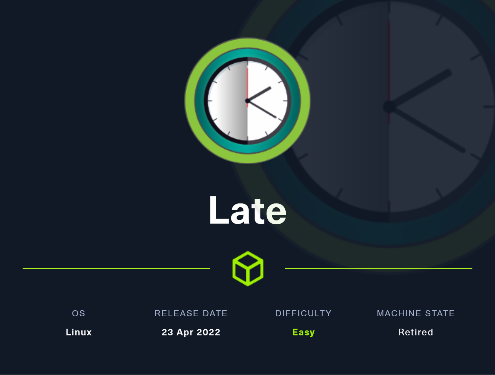
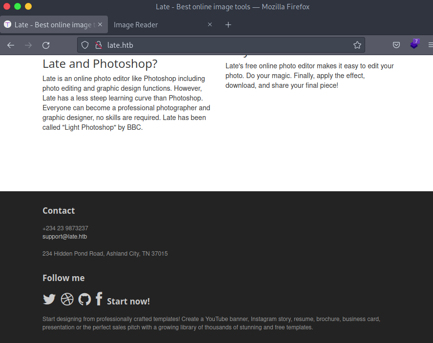
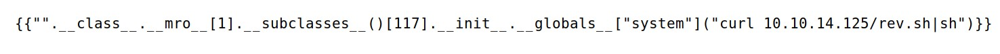

# Late



**June 15, 2022**

Page on port 80:



Vhost enumeration:


Vhost discovered:


If we send an image with a text:


The response of the server is a tag with the text of the image:


Knowing this action we can send a SSTI payload to look if the application responds with an execution.

Sending image:


Response:


Sending the payload to call the sub classes it returns other subclass that doesn’t import system.


Finding the location to call the class: So we need to subtract 1 to call the correct class.


Payload to get the reverse shell:




### Root

Looking the running process with pspy

```python
./pspy64 -f
```


Script to write the reverse shell:


Get session using SSH:


Wait the execution of the script and get the root user:

