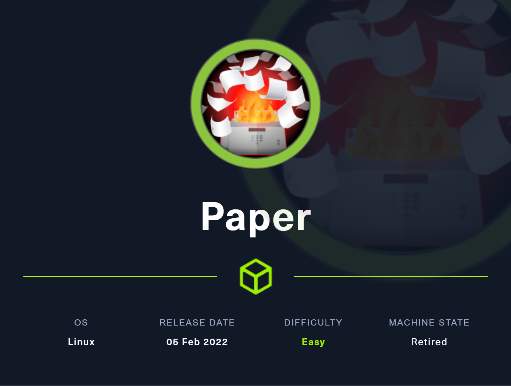
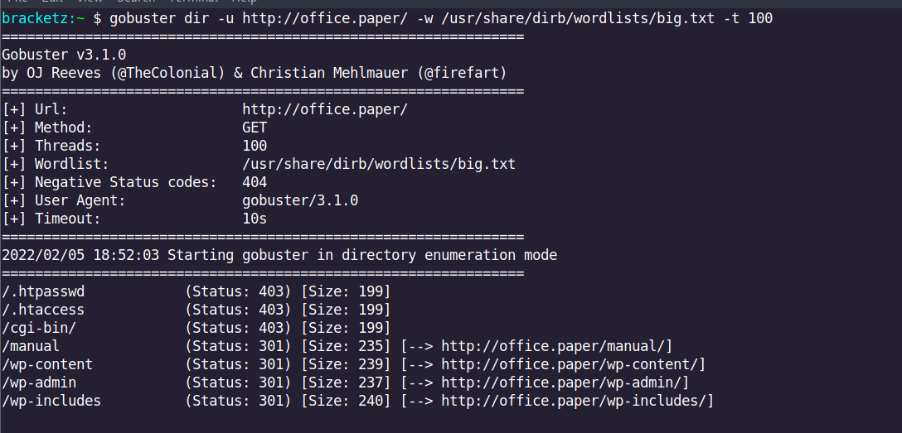

# Paper



**February 5, 2022**

Nmap scan to discover open ports and service versions.

```c
Not shown: 997 closed tcp ports (reset)
PORT    STATE SERVICE  REASON         VERSION
22/tcp  open  ssh      syn-ack ttl 63 OpenSSH 8.0 (protocol 2.0)
| ssh-hostkey: 
|   2048 10:05:ea:50:56:a6:00:cb:1c:9c:93:df:5f:83:e0:64 (RSA)
| ssh-rsa AAAAB3NzaC1yc2EAAAADAQABAAABAQDcZzzauRoUMdyj6UcbrSejflBMRBeAdjYb2Fkpkn55uduA3qShJ5SP33uotPwllc3wESbYzlB9bGJVjeGA2l+G99r24cqvAsqBl0bLStal3RiXtjI/ws1E3bHW1+U35bzlInU7AVC9HUW6IbAq+VNlbXLrzBCbIO+l3281i3Q4Y2pzpHm5OlM2mZQ8EGMrWxD4dPFFK0D4jCAKUMMcoro3Z/U7Wpdy+xmDfui3iu9UqAxlu4XcdYJr7Iijfkl62jTNFiltbym1AxcIpgyS2QX1xjFlXId7UrJOJo3c7a0F+B3XaBK5iQjpUfPmh7RLlt6CZklzBZ8wsmHakWpysfXN
|   256 58:8c:82:1c:c6:63:2a:83:87:5c:2f:2b:4f:4d:c3:79 (ECDSA)
| ecdsa-sha2-nistp256 AAAAE2VjZHNhLXNoYTItbmlzdHAyNTYAAAAIbmlzdHAyNTYAAABBBE/Xwcq0Gc4YEeRtN3QLduvk/5lezmamLm9PNgrhWDyNfPwAXpHiu7H9urKOhtw9SghxtMM2vMIQAUh/RFYgrxg=
|   256 31:78:af:d1:3b:c4:2e:9d:60:4e:eb:5d:03:ec:a0:22 (ED25519)
|_ssh-ed25519 AAAAC3NzaC1lZDI1NTE5AAAAIKdmmhk1vKOrAmcXMPh0XRA5zbzUHt1JBbbWwQpI4pEX
80/tcp  open  http     syn-ack ttl 63 Apache httpd 2.4.37 ((centos) OpenSSL/1.1.1k mod_fcgid/2.3.9)
| http-methods: 
|   Supported Methods: GET POST OPTIONS HEAD TRACE
|_  Potentially risky methods: TRACE
|_http-title: HTTP Server Test Page powered by CentOS
|_http-generator: HTML Tidy for HTML5 for Linux version 5.7.28
|_http-server-header: Apache/2.4.37 (centos) OpenSSL/1.1.1k mod_fcgid/2.3.9
443/tcp open  ssl/http syn-ack ttl 63 Apache httpd 2.4.37 ((centos) OpenSSL/1.1.1k mod_fcgid/2.3.9)
|_ssl-date: TLS randomness does not represent time
|_http-server-header: Apache/2.4.37 (centos) OpenSSL/1.1.1k mod_fcgid/2.3.9
|_http-title: HTTP Server Test Page powered by CentOS
|_http-generator: HTML Tidy for HTML5 for Linux version 5.7.28
| http-methods: 
|   Supported Methods: GET POST OPTIONS HEAD TRACE
|_  Potentially risky methods: TRACE
| ssl-cert: Subject: commonName=localhost.localdomain/organizationName=Unspecified/countryName=US/emailAddress=root@localhost.localdomain
```

Directory scan:

```c
********************************************************
* Wfuzz 3.1.0 - The Web Fuzzer                         *
********************************************************

Target: http://10.129.104.51/FUZZ
Total requests: 30000

=====================================================================
ID           Response   Lines    Word       Chars       Payload                                                            
=====================================================================

000000345:   301        7 L      20 W       236 Ch      "manual"                                                           
000004255:   403        70 L     2438 W     199691 Ch   "http://10.129.104.51/"
```

Directory scan:



Discovering new host:


Subdomain enumeration:


Trying to reading some hidden files as the message was left we found a CVE

[https://www.exploit-db.com/exploits/47690](https://www.exploit-db.com/exploits/47690)


Use ?static=4


Secret registration URL

```jsx
http://chat.office.paper/register/8qozr226AhkCHZdyY
```

Something very cool, the application has a boot and we can use this boot to explore the machine


Listing directory:


Listing the root directory


Listing the home directory we found a boot and a .env with credentials


This is the SSH password of the user dwight.

```jsx
<!=====Contents of file ../../../../../home/dwight/hubot/.env=====>
export ROCKETCHAT_URL='http://127.0.0.1:48320'
export ROCKETCHAT_USER=recyclops
export ROCKETCHAT_PASSWORD=Queenofblad3s!23
export ROCKETCHAT_USESSL=false
export RESPOND_TO_DM=true
export RESPOND_TO_EDITED=true
export PORT=8000
export BIND_ADDRESS=127.0.0.1
<!=====End of file ../../../../../home/dwight/hubot/.env=====>
```

To root I use the new exploit of polkit

[GitHub - berdav/CVE-2021-4034: CVE-2021-4034 1day](https://github.com/berdav/CVE-2021-4034/)


```jsx
root:$6$rfCS6Tb3sgIjkTux$UhBHq5wWPncgtVnltzm3Squ9KBcX3/9k0y6o8AG6lNSKOobHatUWFzPS1J8uuh/QML6kyhZ10ngXa5nCBLDkL.:18811:0:99999:7:::
```