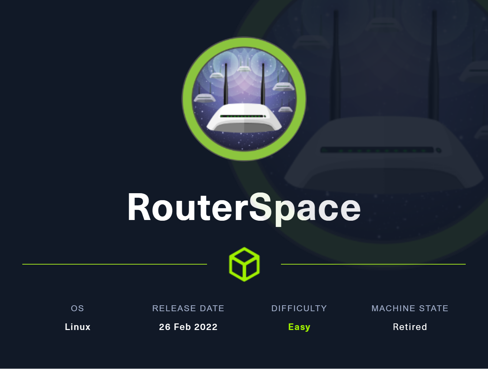
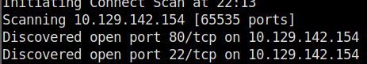

# Router Space

**March 2, 2022**

Two open ports on the machine:

The website has a APK, so the thinking is download the APK and install on an Android virtual machine.

On the android we can click on the check status and request with burpsuite, to do this you need to develop a home lab to test the application, the emulation used was the Android Studio.

Request in burp:

Testing the command injection:

Send you public RSA key to the machine and access using SSH.

In the privilege escalation, looking for versions and vulnerability I found a old version of sudo 1.8.31.

Exploit version:

[https://github.com/mohinparamasivam/Sudo-1.8.31-Root-Exploit](https://github.com/mohinparamasivam/Sudo-1.8.31-Root-Exploit)

After take the exploit, just compile the binary and execute to get the root shell.