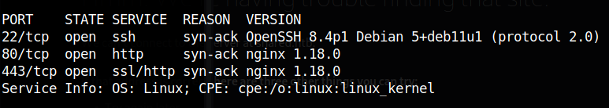

# Shared

Performing a **nmap** scanning to discover open ports and services versions on the machine.



The request on HTTP server lead us to the domain “shared.htb”.


First contact with the main page, it appears to be a CMS called prestashop.


The robots file has interesting parameters and routes to look at.


Performing a subdomain scan, we can look there is a subdomain called checkout.


The domain checkout has data about user’s shopping cart, we need to find a way to fill these columns.


On the main page, we selected a cloth and proceed to checkout button that will send us to the checkout subdomain with some data.


The request is done to the checkout subdomain and the content of the columns  is controlled by the custom_cart cookie, we can try some SQL injections.


The SQL Injection vulnerability worked in the input field. Example sending wrong malicious query:


Correct malicious query, one being equal to one:


Now we can use the scope to perform union select attack.


Query to find the hash of the system:

```python
'union all select 1,group_concat(username, password, '\n'),3 from user#
```

The hash of the user james_mason was converted in the crackstation.


The password and the user was used to login on SSH.


In the prestashop configuration file there is the database credential.


**Dan_smith user**

The user “**dan_smith**” has a script running ipython, to display this information you can use the pspy binary.

[https://github.com/DominicBreuker/pspy](https://github.com/DominicBreuker/pspy)


After some research, I found a report in GitHub talking about the privilege escalation vulnerability using ipython. 


You need to follow the steps of the report to reproduce the exploit, write a reverse-shell in the .py script, copy this script to the “/opt/scripts_review” folder. Remember that, the content of the folder is cleaned time by time, craft a python script to write automatically on the directory.

```python
import os, time

while True:
	os.system("mkdir -m 777 -p /opt/scripts_review/profile_default")
	os.system("mkdir -m 777 -p /opt/scripts_review/profile_default/startup/")
	os.system("cp /home/james_mason/.ipython/profile_default/startup/foo.py /opt/scripts_review/profile_default/startup/foo.py")
	time.sleep(1)
```

After some time the connection was received and we took the flag


The machine has a file called connector, it performs a connection with the redis-server.


After download the binary and tried run this on our machine, when it is executed the binary sends a authentication to the server.


Opening NetCat listener on the port 6379 the authentication key was received.


There is a  sandbox escape in Redis loading lua shared objects.

****Redis Lua Sandbox Escape and Remote Code Execution (CVE-2022-0543)**** [https://github.com/vulhub/vulhub/blob/master/redis/CVE-2022-0543/README.md](https://github.com/vulhub/vulhub/blob/master/redis/CVE-2022-0543/README.md) 

```python
eval 'local io_l = package.loadlib("/usr/lib/x86_64-linux-gnu/liblua5.1.so.0", "luaopen_io"); local io = io_l(); local f = io.popen("id", "r"); local res = f:read("*a"); f:close(); return res' 0
```

After run the command, the root flag was obtained

