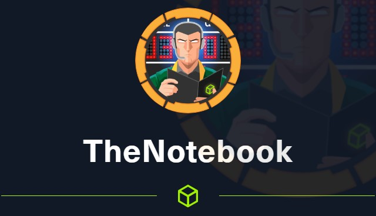

# Notebook



Nmap scan showing services versions and open ports:

```python
# Nmap 7.91 scan initiated Wed May 19 11:19:15 2021 as: nmap -A -sV -o nmap.scan 10.10.10.230
Nmap scan report for 10.10.10.230
Host is up (0.41s latency).
Not shown: 997 closed ports
PORT      STATE    SERVICE VERSION
22/tcp    open     ssh     OpenSSH 7.6p1 Ubuntu 4ubuntu0.3 (Ubuntu Linux; protocol 2.0)
| ssh-hostkey: 
|   2048 86:df:10:fd:27:a3:fb:d8:36:a7:ed:90:95:33:f5:bf (RSA)
|   256 e7:81:d6:6c:df:ce:b7:30:03:91:5c:b5:13:42:06:44 (ECDSA)
|_  256 c6:06:34:c7:fc:00:c4:62:06:c2:36:0e:ee:5e:bf:6b (ED25519)
80/tcp    open     http    nginx 1.14.0 (Ubuntu)
|_http-server-header: nginx/1.14.0 (Ubuntu)
|_http-title: The Notebook - Your Note Keeper
10010/tcp filtered rxapi
Service Info: OS: Linux; CPE: cpe:/o:linux:linux_kernel

Service detection performed. Please report any incorrect results at https://nmap.org/submit/ .
# Nmap done at Wed May 19 11:20:56 2021 -- 1 IP address (1 host up) scanned in 101.02 seconds
```

Analysing the TheBook site, have one cookie in JWT format


So we can change the JWT WEB token for other using a personalized method:


Change alg RS256 to HS256 and in the [localhost](http://localhost) paste your ip:


Now open a NETCAT in 7070 port 

Explaining attack - The web token are making requisition in [localhost](http://localhost) of the machine.  


Note that the server makes a request in our ip, so create a KEY and start web server in folder.

Create a payload in  [https://jwt.io/](https://jwt.io/) using a private key and public key. Change the admin_cap for 1 and login using burpsuite changing the cookie to the new cookie and forwarding each requisition. Without password

KEY:

```python
openssl genrsa 2048 -out jwtRSA256-private.pem
openssl rsa -in privKey.key -pubout -outform PEM -out pubKey.key
```


Delete cookie and uuid, paste new JWT tooken in all requistions of burpsuite or change the browser cookie permanent.


Note that have the Admin panel now


And all get requisitions was made in our privKey.key


Now we can make a reverse shell using php. 

PAY ATTENTION, YOU HAVE TO MAKE THE REQUEST USING WEB TOKEN IN ALL THE PAGES !!!!!!!!

### We got a shell !


Extract the home archive:


Copy the id_rsa priv key to your machine and run ssh with 400 permission

```python
chmod 400 id_rsa
ssh -i id_rsa noah@10.10.10.230
```


[https://kurtikleiton.medium.com/json-web-token-exploitation-for-red-team-580eea1fe46a](https://kurtikleiton.medium.com/json-web-token-exploitation-for-red-team-580eea1fe46a)

In sudo -l command has.


We can execute containers, check the docker version.


In that link have the example how to exploit that.

[https://programmersought.com/article/71085031667/](https://programmersought.com/article/71085031667/)


Compile and sent to the machine, save file with the same name of sudo -l command. This occurs because the command don't set the full path of the archive.


HOSTNAME=0f4c2517af40

Now we have a root session in the container:


Change the exploit getting /etc/shadow to a reverse shell.

Run docker using /bin/bash and run the exploit, after run in notebook using /bin/sh, start netcat in your machine.


Get the root flag.


```python
root:$6$OZ7vREXE$yXjcCfK6rhgAfN5oLisMiB8rE/uoZb7hSqTOYCUTF8lNPXgEiHi7zduz1mrTWtFnhKOCZA9XZu12osORyYnKF.:18670:0:99999:7:::

```

[https://auth0.com/blog/critical-vulnerabilities-in-json-web-token-libraries/](https://auth0.com/blog/critical-vulnerabilities-in-json-web-token-libraries/)

[https://owasp.org/www-chapter-vancouver/assets/presentations/2020-01_Attacking_and_Securing_JWT.pdf](https://owasp.org/www-chapter-vancouver/assets/presentations/2020-01_Attacking_and_Securing_JWT.pdf)

[https://gupta-bless.medium.com/jwt-usage-and-exploitation-56d9db92cf65](https://gupta-bless.medium.com/jwt-usage-and-exploitation-56d9db92cf65)

[https://jwt.io/?_ga=2.161412221.1978456963.1621282616-953880653.1621282616](https://jwt.io/?_ga=2.161412221.1978456963.1621282616-953880653.1621282616)

[https://auth0.com/docs/tokens/json-web-tokens](https://auth0.com/docs/tokens/json-web-tokens)

[https://learn.akamai.com/en-us/webhelp/iot/jwt-access-control/GUID-BD7079F4-09ED-4FAB-A923-4ACFE254BA3E.html](https://learn.akamai.com/en-us/webhelp/iot/jwt-access-control/GUID-BD7079F4-09ED-4FAB-A923-4ACFE254BA3E.html)