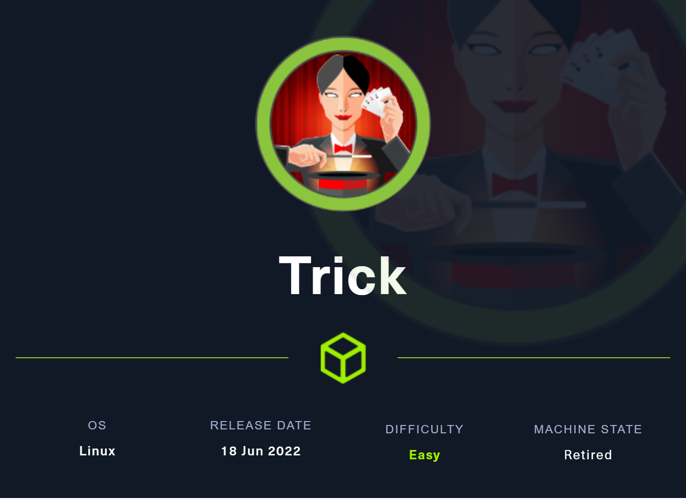
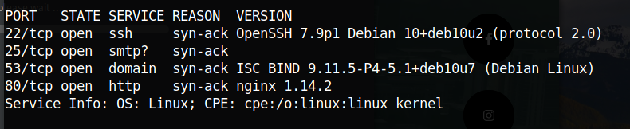

# Trick



**Jun 19, 2022.**

Doing a network port scanning to look the open ports on the machine:



Zone transfer using the trick.htb domain we can discover other subdomain of the machine, the “prepod-payroll.trick.htb”


Bypass authentication using SQL Injection.


LFI using the PHP wrapper to explore the machine:


Reading the database password from the “db_connect” file.


Identifying the number of rows using the SQL injection


Writing a SQL Injection query to write the output in a file:

```python
php://filter/convert.base64-encode/resource=
```


The web-shell worked writing the file on TMP folder.


Spawning a reverse shell using the curl command getting the file from the our machine.


With the past credentials obtained, we will try to authenticate on michael user.


```python

SuperGucciRainbowCake
TrulyImpossiblePasswordLmao123
```

There are some interesting VHOST on the web-server configuration.


Using the VHOST obtained we can access other server and explore a LFI vulnerability .


In this LFI we can use the web-shell written in last exploitation.


Creating a reverse shell to call.


After the execution the reverse shell was obtained.


The user michael can run fail2ban as root.


What is fail2ban?


We can write files on this folder of actions.


Loop to append “multiport.conf” file with +s permission in /bin/bash


Restart fail2ban


Brute some passwords with hydra


After the execution of fail2ban the permissions of “/bin/bash” was changed. 


Root session

