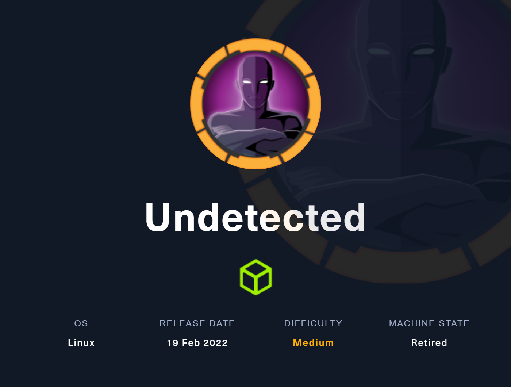
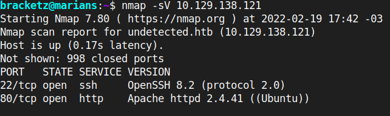

# Undetected



**May 28, 2022**

Nmap scan to discover open ports and service versions.



First contact with the website:


The button redirects to another subdomain:


store.djewlry.htb

Scanning the directories with fuzz-bo0m it returns a interesting PATH: The return was a PHP/eval-stdin.php and this have a vulnerability.


[https://packetstormsecurity.com/files/cve/CVE-2017-9841](https://packetstormsecurity.com/files/cve/CVE-2017-9841)

[https://web.archive.org/web/20170701212357/http://phpunit.vulnbusters.com/](https://web.archive.org/web/20170701212357/http://phpunit.vulnbusters.com/)

We can execute PHP commands using POST request and sending a PHP data:


Reading readable files of own user:

```jsx
find / -readable 2>&-
```

Interesting file in /var/backups:


Download the file to analyze:


Is interesting to see what is this section of code:


Decoding


Cracking the hash of the decode, the result was:

```jsx
ihatehackers
```

Login in SSH


On the apache2 modules folder the mod_read.so object was changed on a different day.

```python
/usr/lib/apache2/modules
```


Is interesting look the strings of this shared object but the machine doesn’t have the strings binary, so we need to download and do the strings command:

The binary appears to have a base64:


Was done some changes in SSHD file:


The -d option is used to set a string: 


The -r of the date binary is:


Now let’s download the SSHD file to analyze.


Interesting section of code of a backdoor activation:


Backdoor code:


It compares the password with the backdoor


So we need to mount this hex to dump in the order

```python
0x5b
0xa9f4
0xbcf0b5e3
0xb2d6f4a0fda0b3d6
0xfdb3d6e7
0xf7bbfdc8
0xa4b3a3f3
0xf0e7abd6
```

Change the endianness according to the array size, and xor based on the xor on the code.


This is the password of the root user, just login in and get the root flag.

```jsx
ssh root@10.10.11.146
```